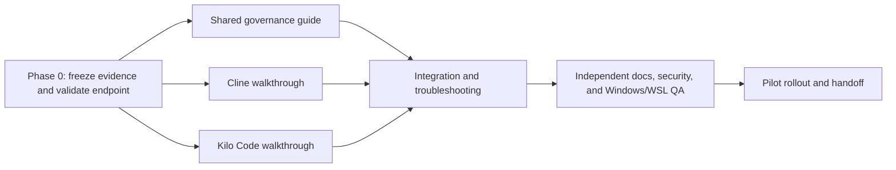

# Enterprise Cline and Kilo Code documentation implementation plan

| Field | Decision |
| --- | --- |
| Tracking | AB#3404 |
| Status | Planned |
| Change classification | Local-only documentation; no shared API or schema changes |
| Documentation home | `agentic-ide-setup/docs/` |
| Target clients | Cline and Kilo Code extensions for VS Code |
| Target environments | Managed Windows workstation and VS Code Remote - WSL |
| Model | GPT-5.6 Sol |
| Authentication | API key |
| Enabled agent capabilities | Terminal, browser, and MCP |
| Additional user-provided data requirements | None specified; enterprise security prerequisites still apply |
| Last source review | 2026-09-01 |

This plan defines the documentation work. It does not install either extension, change
the portable extension manifest, or distribute an API key.

## Objective

Publish a detailed, enterprise-ready administrator guide and two developer walkthroughs
that take a user from an approved VS Code installation to a verified Cline or Kilo Code
session using GPT-5.6 Sol. The walkthroughs must cover both Windows-local and WSL-remote
workspaces and demonstrate terminal, browser, and MCP use without normalizing unsafe
auto-approval.

The first-success path should take 15-30 minutes after the endpoint, API key, extension
package, proxy, and certificate prerequisites are available. Every critical step must
state its expected result and a recovery action.

## Confirmed decisions and bounded assumptions

- The documentation belongs under `agentic-ide-setup/docs/` and is linked from
  `agentic-ide-setup/README.md`.
- The logical model is GPT-5.6 Sol. The published walkthrough must use the exact model or
  deployment identifier returned by the approved endpoint. It must not infer an identifier
  from the display name, guess, or silently substitute another model.
- The golden path uses an enterprise-approved OpenAI or OpenAI-compatible HTTPS endpoint
  and an API key. The base URL, request protocol, and key-issuance system are supplied by
  the enterprise AI-platform owner.
- Formal data-residency, retention, training-use, DLP, and vendor-contract controls are
  outside this request. Basic credential protection, TLS validation, workspace trust,
  and execution-boundary controls remain mandatory.
- Windows and WSL are separate runtime contexts. Extension placement, endpoint reachability,
  certificate trust, environment variables, terminal execution, browser egress, and MCP
  processes must be verified in each context.
- Terminal, browser, and MCP are allowed capabilities. The baseline is prompt-on-use or
  narrowly scoped allow rules, not global auto-approval, Cline YOLO mode, or an equivalent
  unrestricted Kilo policy.
- Adding `saoudrizwan.claude-dev` or `kilocode.kilo-code` to
  `agentic-ide-setup/profile/vscode/extensions.txt` is a separate behavior-changing task.
  This documentation plan may show approved installation commands, but it does not make
  the portable installer install either extension automatically.

## Required inputs before drafting copy/paste configuration

The implementation owner records these values in the PR or validation evidence without
recording the secret itself:

| Input | Owner | Required evidence |
| --- | --- | --- |
| Approved endpoint base URL | AI-platform owner | HTTPS URL and reachable health/models check from Windows and WSL |
| API protocol | AI-platform owner | Responses or Chat Completions request shape confirmed against the endpoint |
| Exact GPT-5.6 Sol identifier | AI-platform owner | Successful non-tool and tool-calling requests using the identifier |
| API-key issue and rotation path | Security/platform owner | Named secret store or credential UI, rotation owner, and revocation procedure |
| Approved Cline version | Endpoint-management owner | Extension ID, exact version, publisher/signature result, and acquisition source |
| Approved Kilo Code version/channel | Endpoint-management owner | Extension ID, exact version, stable/pre-release decision, signature result, and source |
| Proxy and CA configuration | Endpoint/network owner | Required proxy URL/no-proxy rules and trusted CA installation path for both contexts |
| Approved MCP canary | Security/platform owner | Server identity/version, launch boundary, read-only tool, and allowed network/filesystem access |

If the endpoint does not expose a models endpoint, the AI-platform owner must provide the
exact identifier and a successful redacted request/response trace. Endpoint capability,
not a vendor marketing page, is authoritative for the configured identifier.

## Deliverable map

| File | Audience | Purpose |
| --- | --- | --- |
| `agentic-ide-setup/docs/vscode-agent-extension-governance.md` | IT, security, AI platform | Shared approval, distribution, network, credential, workspace-trust, tool, evidence, and rollback controls |
| `agentic-ide-setup/docs/vscode-cline-enterprise-setup.md` | Developers and support | End-to-end Cline setup and Windows/WSL walkthrough |
| `agentic-ide-setup/docs/vscode-kilo-enterprise-setup.md` | Developers and support | End-to-end Kilo Code setup and Windows/WSL walkthrough |
| `agentic-ide-setup/docs/vscode-agent-extension-troubleshooting.md` | Developers and support | Shared diagnostic decision tree and failure recovery |
| `agentic-ide-setup/README.md` | All readers | Short entry point linking the four documents |
| `foundry-vscode-setup/README.md` | Existing Foundry users | One cross-link to the new extension-governance guidance; no topology changes |

Do not add committed secrets, live endpoint hostnames, personal paths, exported sessions,
or screenshots containing account, model-access, or credential information. Prefer text
instructions. Add a screenshot only when a changing UI label cannot be explained clearly
in text, and scrub it before commit.

## Target information architecture

### Shared governance guide

Use this outline for `vscode-agent-extension-governance.md`:

1. **Scope and support matrix**
   - Windows-local and WSL-remote windows.
   - Cline extension ID `saoudrizwan.claude-dev`.
   - Kilo Code extension ID `kilocode.kilo-code`.
   - Exact tested VS Code, extension, WSL, and model identifiers.
2. **Responsibility boundaries**
   - Endpoint management owns extension approval and distribution.
   - AI platform owns endpoint availability, model mapping, quotas, and key lifecycle.
   - Security owns tool, network, MCP, and workspace-trust policy.
   - Developers own repository scope, prompts, approvals, and change review.
3. **Extension acquisition and version policy**
   - Public Marketplace, private Marketplace, or reviewed VSIX procedure.
   - `extensions.allowed` application-setting and `AllowedExtensions` managed-policy
     examples using exact IDs and versions. Verify the names and syntax against the tested
     VS Code release before publishing copy/paste policy.
   - Publisher, signature, checksum, update-ring, and rollback evidence.
   - An explicit decision for Kilo's currently documented pre-release installation path.
4. **Network and certificate prerequisites**
   - Marketplace/update hosts and the approved model endpoint.
   - System proxy, VS Code proxy, WSL proxy, no-proxy, and TLS-inspection paths.
   - Corporate root CA installation in Windows and the WSL distribution.
   - Prohibit disabling strict TLS as a permanent fix.
5. **API-key lifecycle**
   - Issue least-scope keys through the approved system.
   - Enter Cline keys through its credential UI; never place them in repository settings.
   - Prefer a Kilo environment reference or approved credential UI over a literal value in
     `kilo.jsonc`; keep user/global and project configuration responsibilities separate.
   - Cover rotation, revocation, suspected compromise, transcript/log redaction, and WSL
     key duplication explicitly.
6. **Workspace and execution controls**
   - Require Workspace Trust before enabling agent execution.
   - Start with per-action prompts or narrow allow rules.
   - Scope terminal commands to the current repository and identify Windows versus WSL.
   - Limit browser access to approved domains.
   - Allow only reviewed, version-pinned MCP servers; document their process, filesystem,
     network, and secret boundaries.
7. **Audit evidence and support handoff**
   - Record versions, context, test IDs, pass/fail, and sanitized logs.
   - Define support escalation data that does not include secrets or source content.
8. **Disablement and rollback**
   - Disable first, preserve only approved diagnostics, uninstall if needed, restore the
     known-good version, revoke the key, and remove MCP configuration/processes.

### Cline walkthrough

Use this outline for `vscode-cline-enterprise-setup.md`:

1. Goal, supported matrix, tested versions, and limitations.
2. Prerequisites: approved package/version, trusted workspace, endpoint, key, proxy/CA,
   WSL distribution, and approved MCP canary.
3. Install Cline from the approved source and verify the exact extension ID/version.
4. Open a Windows-local workspace and identify where the extension and terminal run.
5. Configure the approved provider:
   - Use the native OpenAI route when the approved endpoint is the official OpenAI API.
   - Use Cline's OpenAI Compatible route when a custom base URL is required.
   - Enter the API key only in the credential field.
   - Select the verified GPT-5.6 Sol identifier and use Cline's connection verification.
   - If Cline Enterprise remote configuration is licensed, add a separate admin/member
     callout explaining locked organization settings; do not make it a prerequisite for
     the local-key path.
6. Run the staged Windows canaries: read-only, bounded terminal, browser, MCP, then a
   disposable file write with explicit approval.
7. Reopen the repository through VS Code Remote - WSL, verify extension placement, and
   repeat endpoint/key/proxy/CA and tool-boundary checks.
8. Review the resulting diff and evidence, then remove the disposable file.
9. Troubleshoot by linking to the shared decision tree.
10. Disable, uninstall, revert version, remove credentials/MCP state, and verify cleanup.

The guide must call out Cline Auto Approve categories individually. It must not recommend
global Auto Approve or YOLO for an enterprise baseline.

### Kilo Code walkthrough

Use this outline for `vscode-kilo-enterprise-setup.md`:

1. Goal, supported matrix, tested versions/channel, and limitations.
2. Prerequisites matching the Cline guide.
3. Install Kilo Code from the approved source and verify the exact extension ID/version.
   Record whether the organization approved the vendor-documented pre-release channel.
4. Open a Windows-local workspace and identify the embedded runtime and terminal boundary.
5. Configure the approved provider:
   - Define a custom OpenAI-compatible provider only when the endpoint is not represented
     correctly by Kilo's native provider.
   - Reference the API key through the approved credential mechanism; never commit it.
   - Register the endpoint-verified model identifier and explicitly configure tool-calling,
     context, output, and reasoning metadata only from endpoint evidence.
   - Keep secrets out of project `kilo.jsonc`; explain user/global versus project config.
6. Define baseline permissions for read, edit, terminal/bash, browser/web, and MCP. Use
   `ask` or narrow allow rules for side-effecting operations and deny unrelated paths.
7. Run the staged Windows canaries.
8. Reopen through VS Code Remote - WSL and repeat installation/runtime, endpoint/key,
   proxy/CA, and tool-boundary checks.
9. Review and clean the disposable change.
10. Troubleshoot, disable, uninstall, version-roll back, remove credentials/MCP state,
    and verify cleanup.

Do not copy a generic OpenAI-compatible example blindly. Kilo's native provider may be
required when an endpoint uses provider-specific GPT request semantics. Phase 0 determines
the correct provider and request protocol before the final snippet is written.

### Shared troubleshooting guide

Organize `vscode-agent-extension-troubleshooting.md` by the first observable failure:

| Symptom | Minimum checks | Escalation owner |
| --- | --- | --- |
| Extension blocked or disabled | ID/version/channel, organization policy, signature, Marketplace/private feed reachability | Endpoint management |
| Extension present locally but missing in WSL | Remote window indicator, local/remote extension placement, WSL server log | Developer enablement |
| 401/403 | Key source, revocation, endpoint header format, entitlement; never print the key | AI platform |
| Model absent or rejected | Exact endpoint model/deployment ID, provider selection, API protocol, entitlement | AI platform |
| 400/tool-call schema error | Responses versus Chat Completions, tool schema, model capability, request parameters | AI platform |
| Timeout/DNS/TLS failure | Windows and WSL DNS, proxy, no-proxy, VPN, CA chain, strict TLS | Network/platform |
| Terminal runs in wrong OS | VS Code window context, selected shell, working directory, extension host | Developer enablement |
| Browser blocked or overbroad | Approved domains, proxy, browser-tool policy, redirect destination | Security/network |
| MCP server missing or fails | Config scope, executable location, version, environment, logs, process/network boundary | MCP owner |
| Approval rules do not persist | User/workspace/remote scope, managed policy, extension update/migration | Endpoint management |
| Unexpected edits or commands | Stop agent, capture sanitized evidence, review Git diff/processes, revoke key if exposure is possible | Security/repository owner |

Every entry must include a safe confirmation step, likely cause, corrective action, and
rollback. Do not use disabling TLS, broadening filesystem access, or turning on global
auto-approval as a troubleshooting shortcut.

## Implementation sequence

### Phase 0 - evidence freeze and canary environment

Owner: AI platform plus developer enablement. Estimated effort: 1-2 engineer-days.

1. Provision a disposable repository, managed Windows test device, supported WSL
   distribution, scoped test API key, and approved endpoint.
2. Record VS Code, Windows, WSL, Cline, and Kilo Code versions and package sources.
3. Confirm the endpoint's exact GPT-5.6 Sol identifier and protocol with redacted direct
   requests before debugging either extension.
4. Confirm basic streaming and one deterministic tool call.
5. Verify endpoint DNS, proxy, and certificate trust independently from Windows and WSL.
6. Select the approved read-only MCP canary and record its version and boundaries.

Exit gate: all required inputs are evidenced, or the blocked input has an owner and the
affected guide section is labeled `Unverified / Needs confirmation`. Do not publish a
copy/paste provider configuration while model/protocol compatibility is unresolved.

### Phase 1 - shared enterprise guidance

Owner: technical writer/developer enablement. Estimated effort: 1 engineer-day.

1. Draft the governance guide from the validated policy and network evidence.
2. Add sanitized Windows and WSL examples only where they were exercised.
3. Define API-key, tool-approval, MCP, evidence, and rollback boundaries.
4. Review with endpoint management, AI platform, and security.

Exit gate: every normative control has an owner and an evidence link; no setting is
presented as centrally enforceable unless the managed test device proves it.

### Phase 2 - product walkthroughs

Owners: one Cline writer and one Kilo writer, working in parallel after Phase 0.
Estimated effort: 1-1.5 engineer-days per guide.

For each extension:

1. Execute the full workflow in a clean Windows-local VS Code profile.
2. Execute it again in a WSL-remote window.
3. Write steps alongside the run so labels, settings, commands, and expected results match.
4. Include the staged canaries and negative tests.
5. Capture only sanitized evidence and link shared controls rather than duplicating them.

Exit gate: a second engineer can reach first success by following only the guide and the
enterprise prerequisites.

### Phase 3 - integration, QA, and pilot

Owner: documentation owner, with independent security and QA reviewers. Estimated effort:
1-2 engineer-days.

1. Draft the shared troubleshooting guide from observed failures.
2. Add navigation links from both existing README files.
3. Run Markdown, link, secret, and Git-diff checks.
4. Have an independent tester execute all four client/context matrix rows.
5. Run one pilot with a developer who did not author the docs.
6. Correct only evidenced defects, rerun affected cases, and obtain approvals.

Exit gate: the validation matrix is complete, no secrets or sensitive diagnostics are in
Git, and the PR is approved by documentation, platform/security, and Windows/WSL QA owners.

## Staged walkthrough canaries

Run these in order and stop at the first failure:

1. **Installation:** exact extension ID/version is enabled in the intended extension host.
2. **Connectivity:** a minimal prompt returns the expected model identity without tools.
3. **Read-only workspace:** list the repository root and quote the README title without edits.
4. **Terminal:** run a harmless OS/context command, report the working directory, and require
   an approval prompt. Windows and WSL outputs must be distinguishable.
5. **Browser:** open one approved HTTPS documentation URL, report its title, and verify the
   final redirect host stays within the allowed domain set.
6. **MCP:** invoke one deterministic read-only tool from the approved pinned server and
   verify its process and configuration scope.
7. **Bounded write:** in the disposable repository, create `agent-canary.txt` containing
   `enterprise-agent-ready`, show the one-file diff, and require explicit approval.
8. **Cleanup:** remove the disposable file through the normal reviewed workflow and confirm
   a clean Git status.

The docs must label a model-generated statement as insufficient evidence. Pass/fail is
based on VS Code state, endpoint/log evidence, tool output, and Git state.

## Validation matrix

The implementation PR must include a sanitized result for every cell:

| Case | Install/context | Provider and model | API key | Proxy/CA | Read | Terminal | Browser | MCP | Write/cleanup | Rollback |
| --- | --- | --- | --- | --- | --- | --- | --- | --- | --- | --- |
| Cline / Windows | Pending | Pending | Pending | Pending | Pending | Pending | Pending | Pending | Pending | Pending |
| Cline / WSL | Pending | Pending | Pending | Pending | Pending | Pending | Pending | Pending | Pending | Pending |
| Kilo / Windows | Pending | Pending | Pending | Pending | Pending | Pending | Pending | Pending | Pending | Pending |
| Kilo / WSL | Pending | Pending | Pending | Pending | Pending | Pending | Pending | Pending | Pending | Pending |

Required negative tests:

- Invalid or revoked API key produces a bounded authentication error without echoing it.
- Unknown GPT-5.6 Sol identifier fails visibly and does not fall back to another model.
- Endpoint blocked by proxy or missing CA produces actionable network/TLS diagnostics.
- Terminal denial prevents command execution.
- Browser denial prevents unapproved egress.
- MCP denial or missing executable prevents server/tool use without bypassing policy.
- Untrusted workspace does not gain execution privileges through a documented override.
- Disable/uninstall or known-good-version rollback leaves no active agent/MCP process and
  no repository change.

## Documentation quality checks

Run these checks before PR review:

- Verify every command in a clean PowerShell session and, where applicable, in WSL Bash.
- Check every internal link and every dated external source.
- Confirm UI labels and setting names against the exact tested extension versions.
- Scan the changed range for keys, tokens, endpoint hostnames, personal paths, account IDs,
  transcripts, and screenshots with sensitive metadata.
- Run `agentic-ide-setup/scripts/Test-AgenticIdeSetup.ps1` if the profile, manifest, or
  scripts change. It is not required for Markdown-only changes unless a link depends on a
  profile artifact.
- Run `git diff --check origin/main..HEAD` after the final base sync.
- Inspect `git diff --name-only origin/main..HEAD`; only the four planned docs, two README
  links, and an explicitly approved docs-validation configuration may appear.

If the repository later adopts a Markdown link checker, pin its version and run it in CI.
Do not add a new production dependency solely for this documentation set.

## Review and ownership gates

| Gate | Reviewer | Approval focus |
| --- | --- | --- |
| Documentation | Developer enablement/technical writer | Completeness, first-success flow, expected results, link integrity |
| AI platform | Endpoint/model owner | Base URL pattern, protocol, exact model identifier, quota, API-key flow |
| Endpoint management | Windows/VS Code owner | Extension source/version/channel, allowlist policy, Windows/WSL placement, rollback |
| Security | Security engineer | Key handling, TLS, workspace trust, approvals, browser egress, MCP boundaries |
| QA | Engineer who did not author the guides | Four matrix runs, negative tests, cleanup, reproducibility |

No deployment or production approval is part of this work. A green docs PR proves only
that the documented flows were validated in the named canary environments.

## Risk register

| Risk | Impact | Mitigation and trigger |
| --- | --- | --- |
| Endpoint maps GPT-5.6 Sol to a different ID or API protocol | Walkthrough fails or silently uses the wrong model | Phase 0 direct canary; stop on fallback or schema mismatch |
| Extension UI/settings change after publication | Steps become stale | Pin tested versions, date sources, and revalidate on extension update |
| Kilo remains pre-release-only in the approved version | Enterprise policy rejects installation/update | Record channel decision, pin package, use a pilot ring and known-good VSIX |
| Windows and WSL use different extension/key/proxy contexts | One matrix path fails or leaks configuration assumptions | Treat them as independent contexts and test all four rows |
| Corporate TLS inspection differs between host and WSL | Endpoint or Marketplace fails only in one context | Install approved CA in each trust store; retain strict TLS |
| API key appears in settings, logs, shell history, or transcripts | Credential compromise | Use credential UI/environment reference, redact evidence, rotate on suspected exposure |
| Broad terminal/browser/MCP auto-approval expands blast radius | Unreviewed side effects or egress | Prompt-on-use/narrow allow rules, disposable canaries, explicit denials and boundaries |
| MCP package or command drifts | Supply-chain or behavior change | Curated server, exact version/checksum, documented process/network/filesystem scope |
| Vendor enterprise features require a license not present | Admin path cannot be reproduced | Keep licensed remote configuration as a labeled optional path; retain local-key baseline |

## Rollout and rollback

Roll out in four rings:

1. Documentation owner on a disposable repository.
2. AI-platform and security reviewers on a managed test device.
3. One developer who did not author the documentation, on Windows and WSL.
4. Broader publication only after the four-row validation matrix passes.

Rollback is documentation plus workstation state, not a production deployment:

1. Mark the affected guide/version as unsupported and stop the rollout.
2. Disable the extension before collecting sanitized diagnostics.
3. Uninstall or restore the approved known-good VSIX/version.
4. Revoke or rotate the test API key if exposure is possible.
5. Stop and remove the MCP canary process/configuration.
6. Remove disposable files and confirm a clean repository.
7. Revert the documentation PR if the golden path is materially wrong; otherwise publish
   a narrow correction with the new validation evidence.

## Maintenance plan

The documentation owner reviews sources and reruns affected matrix rows when any of these
change:

- VS Code enterprise policy, extension-host, Workspace Trust, WSL, proxy, or certificate behavior.
- Cline or Kilo Code extension version, publisher, distribution channel, provider UI, or permission model.
- Endpoint URL, API protocol, GPT-5.6 Sol deployment/model ID, quota, or tool-calling behavior.
- API-key issuance, storage, rotation, or revocation process.
- Approved browser domains or MCP server/version/boundaries.

Perform a lightweight link/version review at least quarterly even when no trigger is
reported. Put the last validated date and tested version matrix at the top of every guide.

## Proposed implementation work items

| ID | Deliverable | Dependency | Size |
| --- | --- | --- | --- |
| DOC-CK-01 | Freeze versions, endpoint protocol/model mapping, network, key, and MCP evidence | Enterprise test environment | 1-2 days |
| DOC-CK-02 | Shared governance guide | DOC-CK-01 | 1 day |
| DOC-CK-03 | Cline Windows/WSL walkthrough | DOC-CK-01 | 1-1.5 days |
| DOC-CK-04 | Kilo Windows/WSL walkthrough | DOC-CK-01 | 1-1.5 days |
| DOC-CK-05 | Troubleshooting, navigation, and cross-links | DOC-CK-02 through DOC-CK-04 | 0.5-1 day |
| DOC-CK-06 | Independent security/docs review and four-row QA pilot | DOC-CK-05 | 1-2 days |

Expected implementation effort is 5-8 engineer-days, excluding lead time for extension
approval, endpoint provisioning, security review, and access to a managed Windows/WSL
canary. Create tracked child items only when implementation begins; AB#3404 tracks this
planning artifact.

## Definition of Done

The documentation implementation is done only when:

- All four planned guides exist and are linked from the designated README files.
- The exact tested VS Code, extension, WSL, endpoint protocol, and GPT-5.6 Sol identifiers
  are recorded with a validation date.
- A new developer completes Cline and Kilo setup in Windows and WSL using the docs alone.
- Terminal, browser, MCP, bounded write, cleanup, negative, and rollback cases pass in all
  applicable matrix rows.
- API-key storage, rotation, revocation, proxy/CA, Workspace Trust, approval, and MCP
  boundaries are explicit and reviewed.
- No key, token, live private endpoint, personal path, sensitive transcript, or unrelated
  file is committed.
- Documentation, AI-platform, endpoint-management, security, and independent QA reviews
  have no unresolved critical finding.
- Relevant Markdown/link/Git checks pass after the final sync with `origin/main`.
- The implementation PR is merged through the repository's protected-branch workflow and
  its Azure Boards child items reflect the actual completion state.

## Authoritative sources to recheck during implementation

- [Cline VS Code extension manifest](https://github.com/cline/cline/blob/main/apps/vscode/package.json)
- [Cline GPT-5.6 Sol model page](https://cline.bot/models/gpt-5-6-sol)
- [Cline OpenAI Compatible provider](https://docs.cline.bot/provider-config/openai-compatible)
- [Cline enterprise OpenAI Compatible admin configuration](https://docs.cline.bot/enterprise-solutions/configuration/remote-configuration/openai-compatible/admin-configuration)
- [Cline enterprise member configuration](https://docs.cline.bot/enterprise-solutions/configuration/remote-configuration/openai-compatible/member-configuration)
- [Cline Auto Approve controls](https://docs.cline.bot/features/auto-approve)
- [Kilo Code VS Code extension manifest](https://github.com/Kilo-Org/kilocode/blob/main/packages/kilo-vscode/package.json)
- [Kilo Code VS Code installation and networking](https://kilo.ai/docs/code-with-ai/platforms/vscode)
- [Kilo custom models and OpenAI-compatible providers](https://kilo.ai/docs/code-with-ai/agents/custom-models)
- [Kilo tool permissions](https://kilo.ai/docs/automate/tools)
- [Kilo GPT-5.6 Sol model page](https://kilo.ai/models/openai-gpt-5-6-sol)
- [VS Code enterprise extension management](https://code.visualstudio.com/docs/enterprise/extensions)
- [VS Code enterprise policies](https://code.visualstudio.com/docs/enterprise/policies)
- [VS Code extension runtime security](https://code.visualstudio.com/docs/configure/extensions/extension-runtime-security)
- [VS Code Workspace Trust](https://code.visualstudio.com/docs/editing/workspaces/workspace-trust)
- [VS Code Remote - WSL](https://code.visualstudio.com/docs/remote/wsl)
