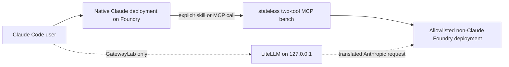

# Claude Code + Microsoft Foundry hybrid kit

This Windows/PowerShell kit keeps Claude Code on a supported native Claude deployment while making other Microsoft Foundry deployments available as an explicit MCP model bench. A separate, disabled-by-default LiteLLM lab can test a non-Claude deployment as Claude Code's primary backend.

## Operating modes

| Mode | Primary model | Other Foundry models | Surface | Support posture |
|---|---|---|---|---|
| `Native` | Claude on Foundry | None | CLI or VS Code | Native provider path |
| `Hybrid` (default) | Claude on Foundry | Explicit `foundry-model-consult` MCP calls | CLI or VS Code | Recommended kit path |
| `GatewayLab` | One allowlisted non-Claude deployment through loopback LiteLLM | Disabled | CLI only | Experimental, target-unverified |



The hybrid skill has a deliberately narrow trigger. Ordinary coding requests stay with native Claude; a second model is consulted only when the user explicitly asks for a Foundry/non-Claude model, another model's opinion, or a cross-model comparison.

## Prerequisites

- PowerShell 7 on Windows.
- Claude Code CLI and the Claude Code VS Code extension.
- Python 3.10 or later for the MCP runtime. The gateway lab separately requires Python 3.11 through 3.13 because LiteLLM 1.99.0 does not start on 3.10. Installer defaults are MCP 3.10 and gateway 3.11.
- A Foundry Claude endpoint and API key, plus deployment names for the Claude tiers you use.
- A Foundry `/openai/v1/` endpoint, API key, and one or more non-Claude deployment names.
- Close all VS Code windows before a kit-managed VS Code launch. VS Code reuses an existing process and otherwise may not inherit the isolated environment.

The kit does not provision models or change Azure resources. It uses API-key authentication only and never writes keys to disk.

## Configure

From this directory:

```powershell
Copy-Item .\config.example.json .\config.local.json
notepad .\config.local.json
```

`config.local.json` is gitignored. It contains only endpoints, deployment names, limits, and a gateway alias—never credentials.

Set exactly one native Claude locator:

- `foundry.claude.baseUrl`: `https://<resource>.services.ai.azure.com/anthropic`, or
- `foundry.claude.resource`: the resource name.

Set the OpenAI-compatible base URL to `https://<resource>.services.ai.azure.com/openai/v1/` (or the equivalent `openai.azure.com` resource URL). Every MCP or gateway deployment must appear in `allowedDeployments`. Hybrid mode passes that list to the bench, filters `list_models()`, and rejects calls outside it; malformed or empty policy fails closed.

Validate without credentials or network calls:

```powershell
.\scripts\Test-ClaudeFoundryHybrid.ps1 -ProfilePath .\config.local.json
```

## Install

The installer is dry-run by default. It creates an isolated `mcp-chatbot` virtual environment, copies the Claude skill to user scope, registers one user-scope stdio MCP server, and writes a nonsecret ownership manifest. It refuses to replace a different MCP registration or skill unless the explicit safe overwrite path applies.

```powershell
# Preview the native + hybrid installation.
.\scripts\Install-ClaudeFoundryHybrid.ps1

# Apply it.
.\scripts\Install-ClaudeFoundryHybrid.ps1 -Apply

# Also install the optional, hash-locked LiteLLM lab.
.\scripts\Install-ClaudeFoundryHybrid.ps1 -Apply -IncludeGatewayLab

# If 3.11 is managed by uv rather than the Windows py launcher:
$gatewayPython = uv python find 3.11
.\scripts\Install-ClaudeFoundryHybrid.ps1 -Apply -IncludeGatewayLab `
  -GatewayPythonCommand $gatewayPython
```

Use `-UseExistingVenvs` only to authorize package installation into pre-existing kit virtual environments. Such environments are never claimed for deletion. Installer-created environments carry a state-root-specific ownership marker; rollback requires the marker before recursive removal.

The optional gateway environment installs only from public PyPI using [`requirements.lock`](gateway/requirements.lock), `--require-hashes`, and binary distributions. The installer runs `pip check`, scans for the known `litellm_init.pth` compromise indicator, and records a nonsecret dependency inventory under `%LOCALAPPDATA%\ClaudeFoundryHybrid`.

## Run

The launcher accepts keys from existing process-scoped `CFH_*` variables or prompts with `Read-Host -AsSecureString`. Prompted values exist transiently in the launcher process and its intended child processes, are restored or cleared on launcher exit, and are never written to disk by the kit.

```powershell
# Recommended: native Claude plus the explicit non-Claude model bench.
.\scripts\Start-ClaudeFoundryHybrid.ps1 `
  -ProfilePath .\config.local.json `
  -Mode Hybrid `
  -Surface Cli

# Native Claude only in a fresh VS Code process.
.\scripts\Start-ClaudeFoundryHybrid.ps1 `
  -ProfilePath .\config.local.json `
  -Mode Native `
  -Surface VSCode `
  -WorkingDirectory C:\path\to\project

# Hybrid mode in VS Code. Close all Code windows first.
.\scripts\Start-ClaudeFoundryHybrid.ps1 `
  -ProfilePath .\config.local.json `
  -Mode Hybrid `
  -Surface VSCode `
  -WorkingDirectory C:\path\to\project
```

Native and MCP credentials are separate prompts. Use `-ReuseNativeKeyForMcp` only when the same key is intentionally authorized for both resources.

Inside Claude Code, ask explicitly, for example:

```text
/foundry-model-bench Ask deployment gpt-5.4 for a second opinion on this bounded design.
Compare the named Foundry deployments on this function; do not send other files.
```

The registered MCP surface contains only filtered `list_models()` and bounded, stateless `chat(model=...)`. It has no local-file, attachment, conversation, collection, agent, or deletion tools. Model output remains advisory and untrusted; Claude must verify important claims against source, tests, or primary documentation.

## Experimental gateway lab

Anthropic documents connecting Claude Code to LLM gateways, but does not support routing Claude Code to non-Claude models. Translation gaps can affect system prompts, tool calls, streaming, token accounting, caching, or future Claude Code protocol changes. For that reason the lab is opt-in, binds only to a random `127.0.0.1` port, exposes one allowlisted model alias, disables docs/admin UI, uses a random per-run local token, and terminates the exact gateway process when Claude exits.

```powershell
.\scripts\Start-ClaudeFoundryHybrid.ps1 `
  -ProfilePath .\config.local.json `
  -Mode GatewayLab `
  -Surface Cli
```

By default the lab starts Claude with only `Read`, `Grep`, and `Glob`, manual permissions, no project MCP servers, no hooks/plugins/memory, and no Chrome integration. `-EnableAgentTools` removes the tool allowlist only; it does not change manual permissions or the other isolation controls. Do not enable it until the target canary passes.

## Doctor and offline tests

```powershell
# Nonsecret installation/read-back report. Makes no Foundry request.
.\scripts\Doctor-ClaudeFoundryHybrid.ps1 -ProfilePath .\config.local.json

# Kit unit tests, PowerShell/lock/redaction checks, and an offline loopback
# gateway boot smoke when the optional lab is installed.
.\scripts\Test-ClaudeFoundryHybrid.ps1 -ProfilePath .\config.local.json

# MCP server tests and real stdio boot smoke test.
..\mcp-chatbot\.venv\Scripts\python.exe -m pytest ..\mcp-chatbot
..\mcp-chatbot\.venv\Scripts\python.exe ..\mcp-chatbot\smoke.py
```

The doctor always reports `targetStatus: target-unverified`; it cannot prove Azure authorization, deployment availability, protocol compatibility, or VS Code behavior without live keys and target-host interaction.

## Target canary runbook

Run these gates on the authorized target machine. Record the Claude Code/extension versions, deployment IDs, date, and pass/fail result without recording keys or prompts containing sensitive source.

1. Run the doctor. Require exact MCP registration match, no compromise indicator, and the expected Python/CLI installations.
2. Start `Native` CLI. Run `/status`, confirm Foundry is the provider and the pinned deployment is selected, then complete a short text prompt.
3. Start `Hybrid` CLI. Run `/mcp`, require `foundry-model-consult` connected and exactly the two bench tools, call `list_models()`, confirm only configured deployments appear, verify one unlisted deployment is rejected without an upstream call, and make one bounded `chat(model=...)` request. This specifically gates MCP environment expansion with subprocess environment scrubbing enabled.
4. Start `Native` and `Hybrid` VS Code sessions from fully closed Code processes. Repeat provider status, one edit-free prompt, MCP inventory, and one bounded model-bench call.
5. Only if steps 1–4 pass, start `GatewayLab`. Verify a text-only prompt first, then structured tool-call behavior with the default read-only tools. Compare the actual tool request, result, streaming completion, and exit cleanup. Leave `-EnableAgentTools` off unless all of those checks pass.
6. After Claude exits, confirm no `litellm` listener remains and no API key appears in the profile, ownership manifest, gateway inventory, temporary files, shell history, or process list.

Until each applicable gate is recorded, label that path `target-unverified`. A native/hybrid pass does not prove the gateway lab, and a CLI pass does not prove VS Code.

## Roll back

Rollback is also dry-run by default. It requires the ownership manifest, verifies the MCP registration and installed skill have not changed, moves the installed skill and manifests to a timestamped trash directory, restores any skill that `-Overwrite` backed up, and removes only virtual environments that the manifest and matching owner marker say this installer created.

```powershell
.\scripts\Uninstall-ClaudeFoundryHybrid.ps1
.\scripts\Uninstall-ClaudeFoundryHybrid.ps1 -Apply
```

If an owned MCP registration or skill has drifted, rollback stops before mutating anything. Resolve the difference manually or restore the recorded content; the script will not guess ownership.

## References

- [Claude Code on Microsoft Foundry](https://code.claude.com/docs/en/microsoft-foundry)
- [Claude Code LLM gateway configuration](https://code.claude.com/docs/en/llm-gateway)
- [Claude Code gateway connection](https://code.claude.com/docs/en/llm-gateway-connect)
- [Claude Code gateway protocol expectations](https://code.claude.com/docs/en/llm-gateway-protocol)
- [Claude Code MCP configuration](https://code.claude.com/docs/en/mcp)
- [Claude Code skills](https://code.claude.com/docs/en/skills)
- [LiteLLM proxy configuration](https://docs.litellm.ai/docs/proxy/configs)
