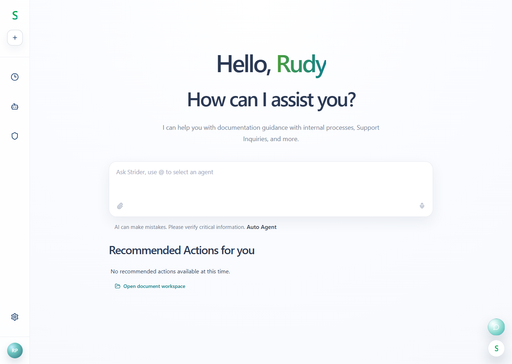

# Assistant Shell Mock

This demo reframes the original file manager mock as a host-shell-style assistant landing page with:

- a narrow left navigation rail
- a centered greeting and composer surface
- floating launcher buttons for chat and workspace access
- a hidden right-side document workspace that preserves the original file tree and file viewer behavior

## Screenshots

Tracked screenshots live in [docs/screenshots/README.md](docs/screenshots/README.md).



## Running the code

```bash
pnpm install
pnpm run dev
```

## Demo capture routes

These URL params are intended for documentation/screenshots:

- `?workspace=open` opens the document workspace on load
- `?chat=open` opens the chat window on load
- `?chat=minimized` opens the minimized chat state on load
- `?prompt=...` seeds the composer text on load
  
