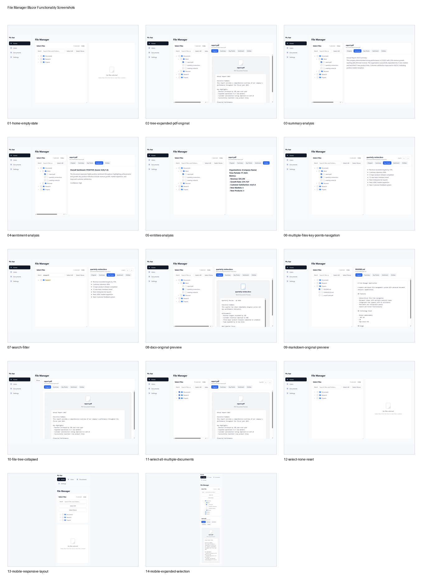

# File Manager Blazor Screenshots

This collection documents the Blazor WebAssembly file manager's mock/demo functionality.

## Coverage

- `01-home-empty-state.png` - initial layout, navigation, file tree, and empty viewer.
- `02-tree-expanded-pdf-original.png` - expanded folders, file selection, PDF original preview.
- `03-summary-analysis.png` - summary analysis mode.
- `04-sentiment-analysis.png` - sentiment analysis mode.
- `05-entities-analysis.png` - entities analysis mode.
- `06-multiple-files-key-points-navigation.png` - multiple selected files, next-file navigation, key points mode.
- `07-search-filter.png` - file tree search/filter behavior.
- `08-docx-original-preview.png` - DOCX preview behavior in original mode.
- `09-markdown-original-preview.png` - markdown preview behavior in original mode.
- `10-file-tree-collapsed.png` - collapsed file tree and restore button.
- `11-select-all-multiple-documents.png` - select-all behavior across mock documents.
- `12-select-none-reset.png` - select-none reset behavior.
- `13-mobile-responsive-layout.png` - narrow mobile layout with the file viewer visible.
- `14-mobile-expanded-selection.png` - narrow mobile layout with the tree expanded and an active selection.
