# Meeting Booking Agent — End-to-End Flows

*Companion to `meeting-booking-agent-design.md` / `.html` (v1.1). This document is the diagram-first view of the same design: every runtime touchpoint, every identity hop, every resource, and the lifecycle of a booking from the assistant's first click to the nightly reconciliation. Section references (§4.4, §5.3, step 1.7, …) point into the main design document; risk IDs (risk R7, risk R11) refer to design §10.*

- **Version** 1.1 · **Date** 2026-08-23 · **Status** Proposed
- **Owner tokens**: `[PA]` Power App developer · `[CS]` Copilot developer · `[ADMIN]` M365/Entra admin (requested by PA or CS) · `[SHARED]` both developers · `[BIZ]` business owner
- **Identity tokens**: `(assistant)` call carries the signed-in assistant's delegated token · `(service)` call runs under the service account's connection · `(app)` call runs under the canvas app user's connection · `(none)` no identity involved
- **ID families**: touchpoints `T1`–`T17` (§17), resources `RS1`–`RS29` (§16), design steps `0.0`–`6.6`, spikes `S1`–`S6`, regression cases `U1`–`U20`, design risks `R1`–`R17`.
- Diagrams are Mermaid and render on GitHub and in any Mermaid-aware viewer.

## Contents

1. [System context](#1-system-context)
2. [Runtime components and touchpoints](#2-runtime-components-and-touchpoints)
3. [Identity and token flow](#3-identity-and-token-flow)
4. [Conversation start and principal validation](#4-conversation-start-and-principal-validation)
5. [End-to-end booking — gathering and fan-out](#5-end-to-end-booking--gathering-and-fan-out)
6. [End-to-end booking — confirm and book](#6-end-to-end-booking--confirm-and-book)
7. [Dialog state machine](#7-dialog-state-machine)
8. [BookingRequest lifecycle](#8-bookingrequest-lifecycle)
9. [Data model](#9-data-model)
10. [Failure paths](#10-failure-paths)
11. [Nightly jobs](#11-nightly-jobs)
12. [Provisioning and identity setup](#12-provisioning-and-identity-setup)
13. [ALM and deployment](#13-alm-and-deployment)
14. [Observability and correlation](#14-observability-and-correlation)
15. [Delivery timeline](#15-delivery-timeline)
16. [Resource inventory](#16-resource-inventory)
17. [Touchpoint inventory](#17-touchpoint-inventory)

---

## 1. System context

Who uses the system, what it talks to, and who provisions what. Solid edges are runtime calls; dotted edges are provisioning or telemetry.

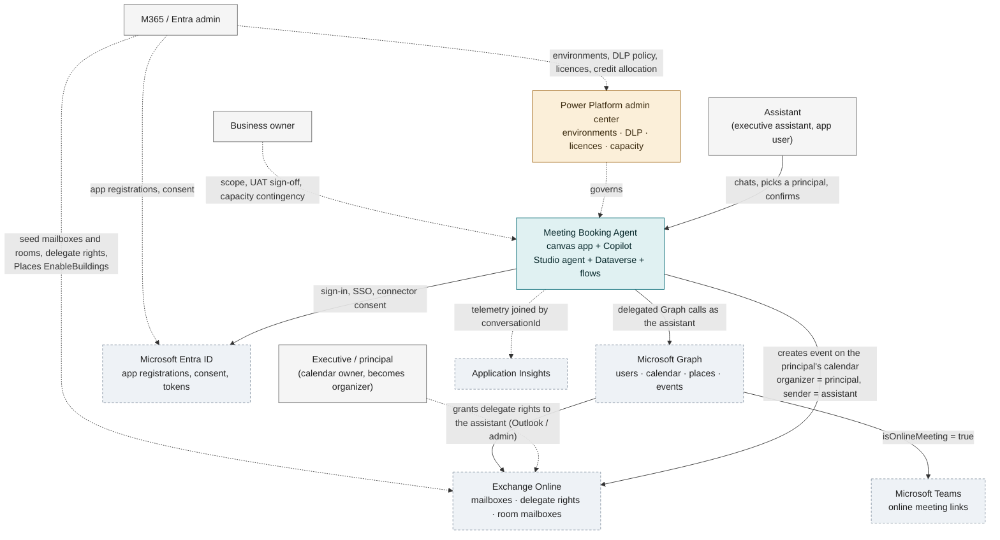
```mermaid
flowchart TB
  classDef person fill:#f5f5f5,stroke:#666,color:#222
  classDef system fill:#e0f1f2,stroke:#0b6e78,color:#06272a
  classDef ext fill:#eef2f6,stroke:#8a97a6,stroke-dasharray:4 3,color:#222
  classDef admin fill:#fbefd9,stroke:#9a5b00,color:#3c2c10

  A["Assistant<br/>(executive assistant, app user)"]:::person
  E["Executive / principal<br/>(calendar owner, becomes organizer)"]:::person
  ADM["M365 / Entra admin"]:::person
  BIZ["Business owner"]:::person

  SYS["Meeting Booking Agent<br/>canvas app + Copilot Studio agent + Dataverse + flows"]:::system

  ENTRA["Microsoft Entra ID<br/>app registrations, consent, tokens"]:::ext
  GRAPH["Microsoft Graph<br/>users · calendar · places · events"]:::ext
  EXO["Exchange Online<br/>mailboxes · delegate rights · room mailboxes"]:::ext
  TEAMS["Microsoft Teams<br/>online meeting links"]:::ext
  AI["Application Insights"]:::ext
  PPAC["Power Platform admin center<br/>environments · DLP · licences · capacity"]:::admin

  A -- "chats, picks a principal, confirms" --> SYS
  SYS -- "creates event on the principal's calendar<br/>organizer = principal, sender = assistant" --> EXO
  E -. "grants delegate rights to the assistant (Outlook / admin)" .-> EXO
  SYS -- "delegated Graph calls as the assistant" --> GRAPH
  GRAPH --> EXO
  GRAPH -- "isOnlineMeeting = true" --> TEAMS
  SYS -- "sign-in, SSO, connector consent" --> ENTRA
  SYS -. "telemetry joined by conversationId" .-> AI
  ADM -. "app registrations, consent" .-> ENTRA
  ADM -. "seed mailboxes and rooms, delegate rights,<br/>Places EnableBuildings" .-> EXO
  ADM -. "environments, DLP policy, licences, credit allocation" .-> PPAC
  PPAC -. governs .-> SYS
  BIZ -. "scope, UAT sign-off, capacity contingency" .-> SYS
```

**Reading the picture.** The system never holds its own calendar identity in the primary design: every write to a calendar is the assistant's own delegated token, so Exchange — not our code — is the authority on who may book for whom. The admin's work is all on the dotted edges and is front-loaded into week 1 (steps 0.0 and 0.7).

---

## 2. Runtime components and touchpoints

Every box is a deployable or provisioned resource; every numbered edge `Tn` is a touchpoint catalogued in [§17](#17-touchpoint-inventory), with its identity in parentheses. Colour = owner. The picture is split in two: **2a** is the runtime call path, **2b** is identity, configuration and telemetry.

### 2a — Runtime path

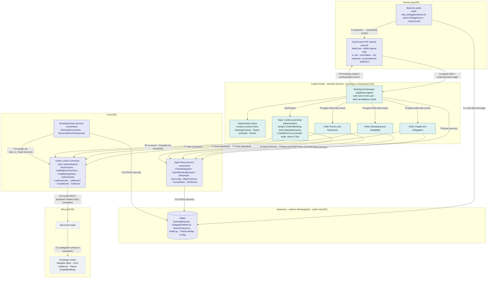
```mermaid
flowchart TB
  classDef pa fill:#e6e8f8,stroke:#3f4fb5,color:#1b2160
  classDef cs fill:#e0f1f2,stroke:#0b6e78,color:#06272a
  classDef ext fill:#eef2f6,stroke:#8a97a6,stroke-dasharray:4 3,color:#222

  subgraph APP["Canvas app  [PA]"]
    direction LR
    PICK["Book-for picker<br/>reads mba_DelegationAllowList where DelegateUpn = User().Email"]:::pa
    PCF["ChatControl PCF (forked, pinned)<br/>WebChat + M365 Agents SDK<br/>in: ids + eventValue · out: response, conversationId, lastEvent"]:::pa
  end

  subgraph AGENT["Copilot Studio · standard harness · generative orchestration  [CS]"]
    ORCH["Booking Orchestrator (published agent)<br/>sole voice to the user · owns all Adaptive Cards"]:::cs
    TOPICS["Deterministic topics<br/>Context (custom event bookingContext) · Switch principal · Cancel"]:::cs
    CONFIRM["Topic: Confirm and Book (deterministic)<br/>renders ConfirmBooking, mints IdempotencyKey,<br/>CreateEvent as an action node, never a Tool"]:::cs
    PD["Child: People and Delegation"]:::cs
    SA["Child: Scheduling and Availability"]:::cs
    RR["Child: Rooms and Resources"]:::cs
  end

  subgraph TOOLS["Tools  [PA]"]
    CONN["Graph custom connector (user authentication)<br/>SearchUsers · GetMailboxTimeZone · FindMeetingTimes · GetSchedule<br/>ListRoomLists · ListRooms · CreateEvent · GetEvent"]:::pa
    FLOWS["Agent flows (service connection)<br/>CheckDelegation · UpsertBookingRequest · WriteAudit ·<br/>GetConfig · MapTimeZone · FormatSlots · GetRooms"]:::pa
    NIGHTLY["Scheduled flows (service connection)<br/>RefreshRoomCache · ReconcileRoomResponses"]:::pa
  end

  subgraph DATA["Dataverse · solution MeetingAgent · prefix mba  [PA]"]
    DVT[("Tables<br/>BookingRequest · DelegationAllowList · RoomPreference ·<br/>AuditLog · TimeZoneMap · Config")]:::pa
  end

  subgraph M365["Microsoft 365"]
    GRAPH["Microsoft Graph"]:::ext
    EXO["Exchange Online<br/>delegate rights · room mailboxes · Places EnableBuildings"]:::ext
  end

  PICK -- "T1 read allow-list (app)" --> DVT
  PICK -- "T2 selection → eventValue (none)" --> PCF
  PCF -- "T4 Agents SDK + bookingContext (app)" --> ORCH
  ORCH --> TOPICS
  ORCH -- "SlotChosen" --> CONFIRM
  ORCH -- "T6 typed child calls (none)" --> PD & SA & RR
  PD & SA & RR -- "T7 tools (assistant)" --> CONN
  CONFIRM -- "T8 re-check + CreateEvent (assistant)" --> CONN
  ORCH & PD & SA & RR & CONFIRM -- "T9 flows (service)" --> FLOWS
  CONN -- "T11 Graph REST, assistant's bearer token (assistant)" --> GRAPH
  GRAPH -- "T12 delegation enforced (assistant)" --> EXO
  FLOWS -- "T13 CRUD (service)" --> DVT
  NIGHTLY -- "T13 CRUD (service)" --> DVT
  NIGHTLY -- "T14 Graph via mba_cr_Graph (service)" --> CONN
  ORCH -- "T15 booking.created / booking.failed (none)" --> PCF
```

### 2b — Identity, configuration and telemetry

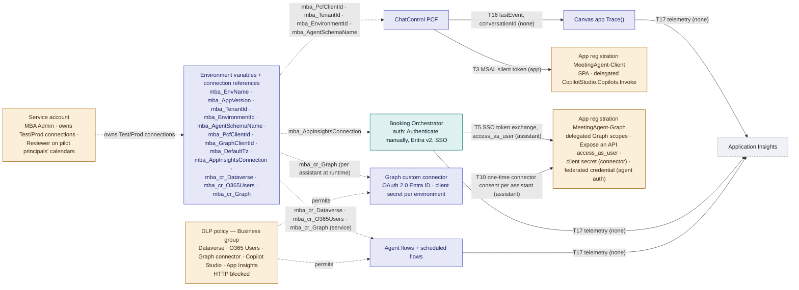
```mermaid
flowchart LR
  classDef pa fill:#e6e8f8,stroke:#3f4fb5,color:#1b2160
  classDef cs fill:#e0f1f2,stroke:#0b6e78,color:#06272a
  classDef admin fill:#fbefd9,stroke:#9a5b00,color:#3c2c10
  classDef ext fill:#eef2f6,stroke:#8a97a6,stroke-dasharray:4 3,color:#222

  PCF["ChatControl PCF"]:::pa
  TRACE["Canvas app Trace()"]:::pa
  ORCH["Booking Orchestrator<br/>auth: Authenticate manually, Entra v2, SSO"]:::cs
  CONN["Graph custom connector<br/>OAuth 2.0 Entra ID · client secret per environment"]:::pa
  FLOWS["Agent flows + scheduled flows"]:::pa
  CFG["Environment variables + connection references<br/>mba_EnvName · mba_AppVersion · mba_TenantId · mba_EnvironmentId · mba_AgentSchemaName ·<br/>mba_PcfClientId · mba_GraphClientId · mba_DefaultTz · mba_AppInsightsConnection ·<br/>mba_cr_Dataverse · mba_cr_O365Users · mba_cr_Graph"]:::pa
  REGC["App registration MeetingAgent-Client<br/>SPA · delegated CopilotStudio.Copilots.Invoke"]:::admin
  REGG["App registration MeetingAgent-Graph<br/>delegated Graph scopes · Expose an API access_as_user ·<br/>client secret (connector) · federated credential (agent auth)"]:::admin
  SVC["Service account<br/>MBA Admin · owns Test/Prod connections ·<br/>Reviewer on pilot principals' calendars"]:::admin
  DLP["DLP policy — Business group<br/>Dataverse · O365 Users · Graph connector · Copilot Studio · App Insights<br/>HTTP blocked"]:::admin
  AI["Application Insights"]:::ext

  PCF -- "T3 MSAL silent token (app)" --> REGC
  ORCH -- "T5 SSO token exchange, access_as_user (assistant)" --> REGG
  CONN -- "T10 one-time connector consent per assistant (assistant)" --> REGG
  PCF -- "T16 lastEvent, conversationId (none)" --> TRACE
  TRACE & ORCH & FLOWS -- "T17 telemetry (none)" --> AI
  CFG -. "mba_PcfClientId · mba_TenantId · mba_EnvironmentId · mba_AgentSchemaName" .-> PCF
  CFG -. "mba_AppInsightsConnection" .-> ORCH
  CFG -. "mba_cr_Graph (per assistant at runtime)" .-> CONN
  CFG -. "mba_cr_Dataverse · mba_cr_O365Users · mba_cr_Graph (service)" .-> FLOWS
  SVC -. "owns Test/Prod connections" .-> CFG
  DLP -. permits .-> CONN
  DLP -. permits .-> FLOWS
```

**Two rules make the pictures consistent.** (1) Anything that must carry the assistant's identity goes through a user-authenticated tool (`T7`, `T8`, `T11`); anything that is bookkeeping goes through a flow under the service account (`T9`, `T13`). (2) Only the two nightly flows call Graph from a flow (`T14`), through the same connector under the service account's connection.

---

## 3. Identity and token flow

How the assistant's identity travels from the browser to Exchange. The primary path is delegated; the `alt` at the end shows what changes if spike S2 fails and the application-identity fallback (step 0.2b) is activated.

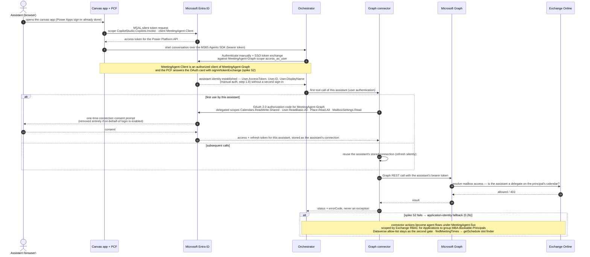
```mermaid
sequenceDiagram
  autonumber
  actor A as Assistant (browser)
  participant APP as Canvas app + PCF
  participant ENTRA as Microsoft Entra ID
  participant O as Orchestrator
  participant CONN as Graph connector
  participant G as Microsoft Graph
  participant EXO as Exchange Online

  A->>APP: opens the canvas app (Power Apps sign-in already done)
  APP->>ENTRA: MSAL silent token request<br/>scope CopilotStudio.Copilots.Invoke · client MeetingAgent-Client
  ENTRA-->>APP: access token for the Power Platform API
  APP->>O: start conversation over the M365 Agents SDK (bearer token)
  O->>ENTRA: Authenticate manually + SSO token exchange<br/>against MeetingAgent-Graph scope access_as_user
  Note over APP,O: MeetingAgent-Client is an authorized client of MeetingAgent-Graph<br/>and the PCF answers the OAuth card with signin/tokenExchange (spike S2)
  ENTRA-->>O: assistant identity established — User.AccessToken, User.ID, User.DisplayName<br/>(manual auth, step 1.8) without a second sign-in
  O->>CONN: first tool call of this assistant (user authentication)
  alt first use by this assistant
    CONN->>ENTRA: OAuth 2.0 authorization code for MeetingAgent-Graph<br/>delegated scopes Calendars.ReadWrite.Shared · User.ReadBasic.All · Place.Read.All · MailboxSettings.Read
    ENTRA-->>A: one-time connection consent prompt<br/>(removed entirely if on-behalf-of login is enabled)
    A-->>ENTRA: consent
    ENTRA-->>CONN: access + refresh token for this assistant, stored as the assistant's connection
  else subsequent calls
    CONN->>CONN: reuse the assistant's stored connection (refresh silently)
  end
  CONN->>G: Graph REST call with the assistant's bearer token
  G->>EXO: resolve mailbox access — is the assistant a delegate on the principal's calendar?
  EXO-->>G: allowed / 403
  G-->>CONN: result
  CONN-->>O: status + errorCode, never an exception
  alt spike S2 fails → application-identity fallback (0.2b)
    Note over O,EXO: connector actions become agent flows under MeetingAgent-Svc<br/>scoped by Exchange RBAC for Applications to group MBA-Bookable-Principals<br/>Dataverse allow-list stays as the second gate · findMeetingTimes → getSchedule slot finder
  end
```

**Where each secret lives.** The PCF has no secret (public SPA client). Agent authentication uses a federated credential on the `MeetingAgent-Graph` registration. The only secret in the delegated design is the **connector's client secret** on that same registration, entered in the connector's Security tab per environment — not deployed by the pipeline — with a rotation date tracked in the design §9 security checklist. Nothing in a topic or a flow holds a secret.

---

## 4. Conversation start and principal validation

What happens before the assistant types a word, and the only path that ends the conversation before any question is asked.

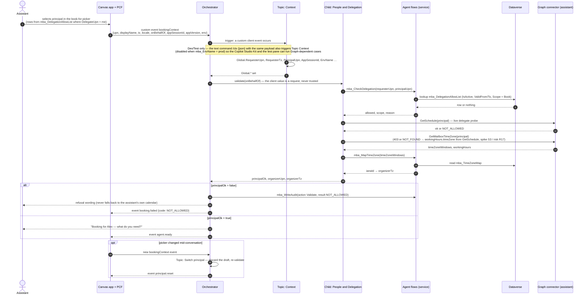
```mermaid
sequenceDiagram
  autonumber
  actor A as Assistant
  participant APP as Canvas app + PCF
  participant O as Orchestrator
  participant CTX as Topic: Context
  participant PD as Child: People and Delegation
  participant F as Agent flows (service)
  participant DV as Dataverse
  participant CONN as Graph connector (assistant)

  A->>APP: selects principal in the book-for picker<br/>(rows from mba_DelegationAllowList where DelegateUpn = me)
  APP->>O: custom event bookingContext<br/>{upn, displayName, tz, locale, onBehalfOf, appSessionId, appVersion, env}
  O->>CTX: trigger: a custom client event occurs
  Note over O,CTX: Dev/Test only — the text command /ctx {json} with the same payload also triggers Topic Context<br/>(disabled when mba_EnvName = prod) so the Copilot Studio Kit and the test pane can run Graph-dependent cases
  CTX->>CTX: Global.RequesterUpn, RequesterTz, PrincipalUpn, AppSessionId, EnvName …
  CTX-->>O: Global.* set
  O->>PD: validate(onBehalfOf) — the client value is a request, never trusted
  PD->>F: mba_CheckDelegation(requesterUpn, principalUpn)
  F->>DV: lookup mba_DelegationAllowList (IsActive, ValidFrom/To, Scope = Book)
  DV-->>F: row or nothing
  F-->>PD: allowed, scope, reason
  PD->>CONN: GetSchedule(principal) — live delegate probe
  CONN-->>PD: ok or NOT_ALLOWED
  PD->>CONN: GetMailboxTimeZone(principal)<br/>(403 or NOT_FOUND → workingHours.timeZone from GetSchedule, spike S3 / risk R17)
  CONN-->>PD: timeZoneWindows, workingHours
  PD->>F: mba_MapTimeZone(timeZoneWindows)
  F->>DV: read mba_TimeZoneMap
  F-->>PD: ianaId → organizerTz
  PD-->>O: principalOk, organizerUpn, organizerTz
  alt principalOk = false
    O->>F: mba_WriteAudit(action Validate, result NOT_ALLOWED)
    O-->>A: refusal wording (never falls back to the assistant's own calendar)
    O-->>APP: event booking.failed {code: NOT_ALLOWED}
  else principalOk = true
    O-->>A: "Booking for Alex — what do you need?"
    O-->>APP: event agent.ready
  end
  opt picker changed mid-conversation
    APP->>O: new bookingContext event
    O->>O: Topic: Switch principal — discard the draft, re-validate
    O-->>APP: event principal.reset
  end
```

---

## 5. End-to-end booking — gathering and fan-out

The progressive fan-out described in design §4.6: each child is called as soon as its typed inputs can be satisfied; children never address the assistant; the orchestrator phrases every question. This run uses the worked example *"45 min with Megan and Christie next week, room for six in Building 2"*.

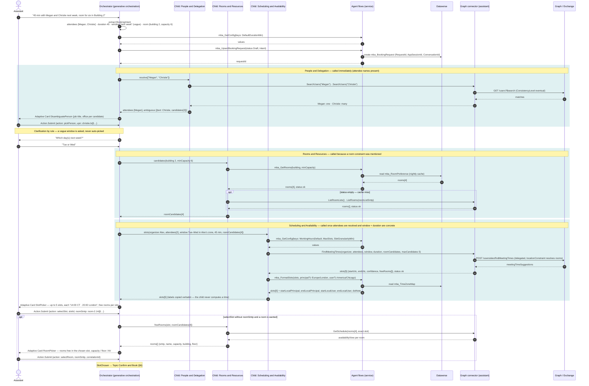
```mermaid
sequenceDiagram
  autonumber
  actor A as Assistant
  participant O as Orchestrator (generative orchestration)
  participant PD as Child: People and Delegation
  participant RR as Child: Rooms and Resources
  participant SA as Child: Scheduling and Availability
  participant F as Agent flows (service)
  participant DV as Dataverse
  participant CONN as Graph connector (assistant)
  participant G as Graph / Exchange

  A->>O: "45 min with Megan and Christie next week, room for six in Building 2"
  O->>O: extract BookingIntent<br/>attendees [Megan, Christie] · duration 45 · window "next week" (vague) · room {building 2, capacity 6}
  O->>F: mba_GetConfig(keys: DefaultDurationMin)
  F-->>O: values
  O->>F: mba_UpsertBookingRequest(status Draft, intent)
  F->>DV: create mba_BookingRequest (RequestId, AppSessionId, ConversationId)
  F-->>O: requestId

  rect rgb(224, 241, 242)
    Note over O,G: People and Delegation — called immediately (attendee names present)
    O->>PD: resolve(["Megan", "Christie"])
    PD->>CONN: SearchUsers("Megan") · SearchUsers("Christie")
    CONN->>G: GET /users?$search (ConsistencyLevel eventual)
    G-->>CONN: matches
    CONN-->>PD: Megan: one · Christie: many
    PD-->>O: attendees [Megan], ambiguous [{text: Christie, candidates[2]}]
    O-->>A: Adaptive Card DisambiguatePerson (job title, office per candidate)
    A->>O: Action.Submit {action: pickPerson, upn: christie.b@…}
  end

  Note over O,A: Clarification by rule — a vague window is asked, never auto-picked
  O-->>A: "Which day(s) next week?"
  A->>O: "Tue or Wed"

  rect rgb(224, 241, 242)
    Note over O,G: Rooms and Resources — called because a room constraint was mentioned
    O->>RR: candidates(building 2, minCapacity 6)
    RR->>F: mba_GetRooms(building, minCapacity)
    F->>DV: read mba_RoomPreference (nightly cache)
    DV-->>F: rooms[4]
    F-->>RR: rooms[4], status ok
    opt status empty — cache miss
      RR->>CONN: ListRoomLists() · ListRooms(roomListSmtp)
      CONN-->>RR: rooms[], status ok
    end
    RR-->>O: roomCandidates[4]
  end

  rect rgb(224, 241, 242)
    Note over O,G: Scheduling and Availability — called once attendees are resolved and window + duration are concrete
    O->>SA: slots(organizer Alex, attendees[2], window Tue–Wed in Alex's zone, 45 min, roomCandidates[4])
    SA->>F: mba_GetConfig(keys: WorkingHoursDefault, MaxSlots, SlotGranularityMin)
    F-->>SA: values
    SA->>CONN: FindMeetingTimes(organizer, attendees, window, duration, roomCandidates, maxCandidates 5)
    CONN->>G: POST /users/alex/findMeetingTimes (delegated, locationConstraint resolves rooms)
    G-->>CONN: meetingTimeSuggestions
    CONN-->>SA: slots[5] {startUtc, endUtc, confidence, freeRooms[]}, status ok
    SA->>F: mba_FormatSlots(slots, principalTz Europe/London, userTz America/Chicago)
    F->>DV: read mba_TimeZoneMap
    F-->>SA: slots[5] + startLocalPrincipal, endLocalPrincipal, startLocalUser, endLocalUser, dstNote
    SA-->>O: slots[5] (labels copied verbatim — the child never computes a time)
  end

  O-->>A: Adaptive Card SlotPicker — up to 5 slots, each "14:00 CT · 20:00 London", free rooms per slot
  A->>O: Action.Submit {action: selectSlot, slotId, roomSmtp: room-2.14@…}
  opt selectSlot without roomSmtp and a room is wanted
    O->>RR: freeRooms(slot, roomCandidates[4])
    RR->>CONN: GetSchedule(rooms[4], exact slot)
    CONN-->>RR: availabilityView per room
    RR-->>O: rooms[] {smtp, name, capacity, building, floor}
    O-->>A: Adaptive Card RoomPicker — rooms free in the chosen slot, capacity / floor / AV
    A->>O: Action.Submit {action: selectRoom, roomSmtp, correlationId}
  end
  Note over O: SlotChosen → Topic Confirm and Book (§6)
```

---

## 6. End-to-end booking — confirm and book

The deterministic close. From the confirmation card onward no model decision sits between the assistant and the Graph write; every step is a node in the *Confirm and Book* topic, which renders the card, mints the idempotency key, re-checks, books and reports.

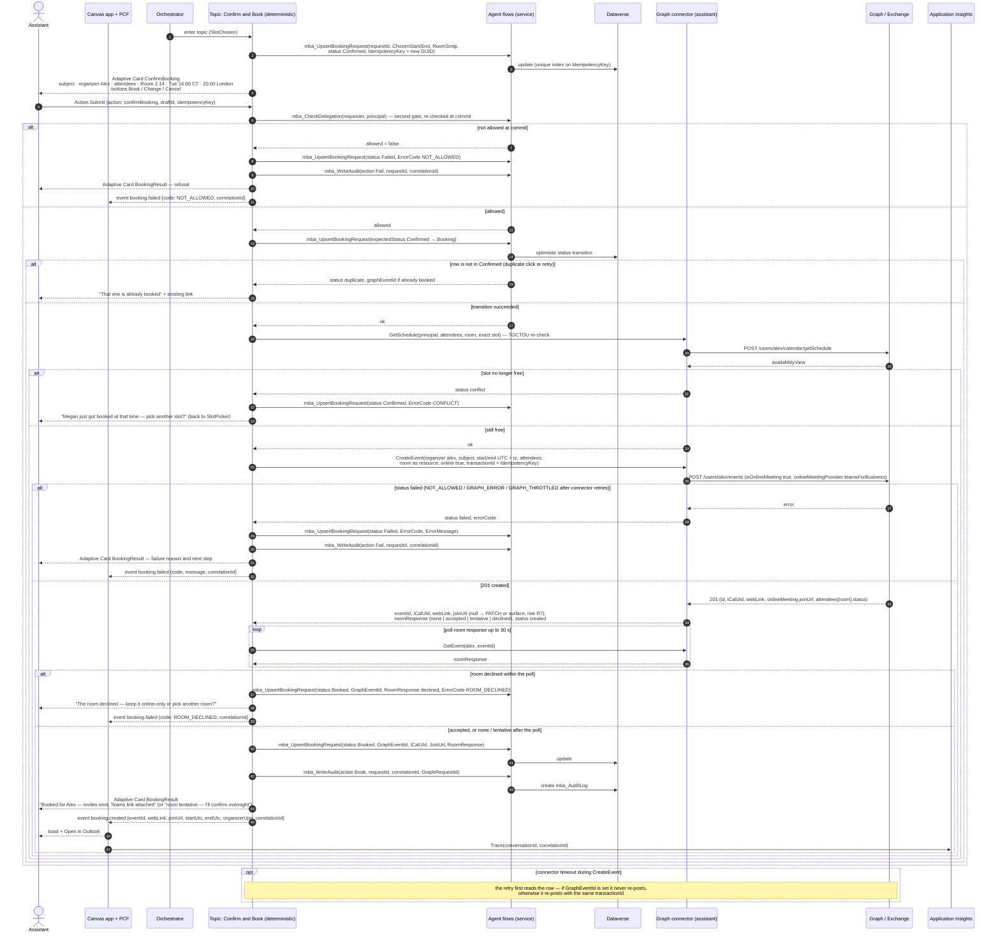
```mermaid
sequenceDiagram
  autonumber
  actor A as Assistant
  participant APP as Canvas app + PCF
  participant O as Orchestrator
  participant CB as Topic: Confirm and Book (deterministic)
  participant F as Agent flows (service)
  participant DV as Dataverse
  participant CONN as Graph connector (assistant)
  participant G as Graph / Exchange
  participant AI as Application Insights

  O->>CB: enter topic (SlotChosen)
  CB->>F: mba_UpsertBookingRequest(requestId, ChosenStart/End, RoomSmtp,<br/>status Confirmed, IdempotencyKey = new GUID)
  F->>DV: update (unique index on IdempotencyKey)
  CB-->>A: Adaptive Card ConfirmBooking<br/>subject · organizer Alex · attendees · Room 2.14 · Tue 14:00 CT · 20:00 London<br/>buttons Book / Change / Cancel
  A->>CB: Action.Submit {action: confirmBooking, draftId, idempotencyKey}

  CB->>F: mba_CheckDelegation(requester, principal) — second gate, re-checked at commit
  alt not allowed at commit
    F-->>CB: allowed = false
    CB->>F: mba_UpsertBookingRequest(status Failed, ErrorCode NOT_ALLOWED)
    CB->>F: mba_WriteAudit(action Fail, requestId, correlationId)
    CB-->>A: Adaptive Card BookingResult — refusal
    CB-->>APP: event booking.failed {code: NOT_ALLOWED, correlationId}
  else allowed
    F-->>CB: allowed
    CB->>F: mba_UpsertBookingRequest(expectedStatus Confirmed → Booking)
    F->>DV: optimistic status transition
    alt row is not in Confirmed (duplicate click or retry)
      F-->>CB: status duplicate, graphEventId if already booked
      CB-->>A: "That one is already booked" + existing link
    else transition succeeded
      F-->>CB: ok
      CB->>CONN: GetSchedule(principal, attendees, room, exact slot) — TOCTOU re-check
      CONN->>G: POST /users/alex/calendar/getSchedule
      G-->>CONN: availabilityView
      alt slot no longer free
        CONN-->>CB: status conflict
        CB->>F: mba_UpsertBookingRequest(status Confirmed, ErrorCode CONFLICT)
        CB-->>A: "Megan just got booked at that time — pick another slot?" (back to SlotPicker)
      else still free
        CONN-->>CB: ok
        CB->>CONN: CreateEvent(organizer alex, subject, start/end UTC + tz, attendees,<br/>room as resource, online true, transactionId = IdempotencyKey)
        CONN->>G: POST /users/alex/events (isOnlineMeeting true, onlineMeetingProvider teamsForBusiness)
        alt status failed (NOT_ALLOWED / GRAPH_ERROR / GRAPH_THROTTLED after connector retries)
          G-->>CONN: error
          CONN-->>CB: status failed, errorCode
          CB->>F: mba_UpsertBookingRequest(status Failed, ErrorCode, ErrorMessage)
          CB->>F: mba_WriteAudit(action Fail, requestId, correlationId)
          CB-->>A: Adaptive Card BookingResult — failure reason and next step
          CB-->>APP: event booking.failed {code, message, correlationId}
        else 201 created
          G-->>CONN: 201 {id, iCalUId, webLink, onlineMeeting.joinUrl, attendees[room].status}
          CONN-->>CB: eventId, iCalUId, webLink, joinUrl (null → PATCH or surface, risk R7),<br/>roomResponse (none | accepted | tentative | declined), status created
          loop poll room response up to 30 s
            CB->>CONN: GetEvent(alex, eventId)
            CONN-->>CB: roomResponse
          end
          alt room declined within the poll
            CB->>F: mba_UpsertBookingRequest(status Booked, GraphEventId, RoomResponse declined, ErrorCode ROOM_DECLINED)
            CB-->>A: "The room declined — keep it online-only or pick another room?"
            CB-->>APP: event booking.failed {code: ROOM_DECLINED, correlationId}
          else accepted, or none / tentative after the poll
            CB->>F: mba_UpsertBookingRequest(status Booked, GraphEventId, ICalUId, JoinUrl, RoomResponse)
            F->>DV: update
            CB->>F: mba_WriteAudit(action Book, requestId, correlationId, GraphRequestId)
            F->>DV: create mba_AuditLog
            CB-->>A: Adaptive Card BookingResult<br/>"Booked for Alex — invites sent, Teams link attached" (or "room tentative — I'll confirm overnight")
            CB-->>APP: event booking.created {eventId, webLink, joinUrl, startUtc, endUtc, organizerUpn, correlationId}
            APP-->>A: toast + Open in Outlook
            APP->>AI: Trace(conversationId, correlationId)
          end
        end
      end
    end
  end
  opt connector timeout during CreateEvent
    Note over CB,G: the retry first reads the row — if GraphEventId is set it never re-posts,<br/>otherwise it re-posts with the same transactionId
  end
```

---

## 7. Dialog state machine

The conversation as the orchestrator experiences it. **7a** is the outer machine; **7b** expands the *Gathering* state, which generative orchestration governs. Everything from *Confirming* onward is deterministic topics.

### 7a — Outer machine

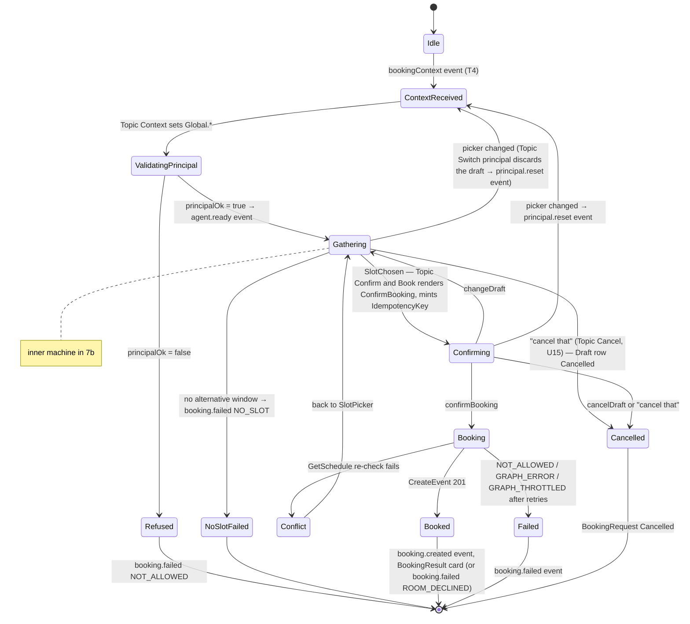
```mermaid
stateDiagram-v2
  [*] --> Idle
  Idle --> ContextReceived: bookingContext event (T4)
  ContextReceived --> ValidatingPrincipal: Topic Context sets Global.*
  ValidatingPrincipal --> Refused: principalOk = false
  Refused --> [*]: booking.failed NOT_ALLOWED
  ValidatingPrincipal --> Gathering: principalOk = true → agent.ready event
  note right of Gathering
    inner machine in 7b
  end note
  Gathering --> Confirming: SlotChosen — Topic Confirm and Book renders ConfirmBooking, mints IdempotencyKey
  Gathering --> Cancelled: "cancel that" (Topic Cancel, U15) — Draft row Cancelled
  Gathering --> NoSlotFailed: no alternative window → booking.failed NO_SLOT
  NoSlotFailed --> [*]
  Confirming --> Gathering: changeDraft
  Confirming --> Cancelled: cancelDraft or "cancel that"
  Confirming --> Booking: confirmBooking
  Booking --> Conflict: GetSchedule re-check fails
  Conflict --> Gathering: back to SlotPicker
  Booking --> Booked: CreateEvent 201
  Booking --> Failed: NOT_ALLOWED / GRAPH_ERROR / GRAPH_THROTTLED after retries
  Booked --> [*]: booking.created event, BookingResult card (or booking.failed ROOM_DECLINED)
  Failed --> [*]: booking.failed event
  Cancelled --> [*]: BookingRequest Cancelled
  Gathering --> ContextReceived: picker changed (Topic Switch principal discards the draft → principal.reset event)
  Confirming --> ContextReceived: picker changed → principal.reset event
```

### 7b — Inside Gathering

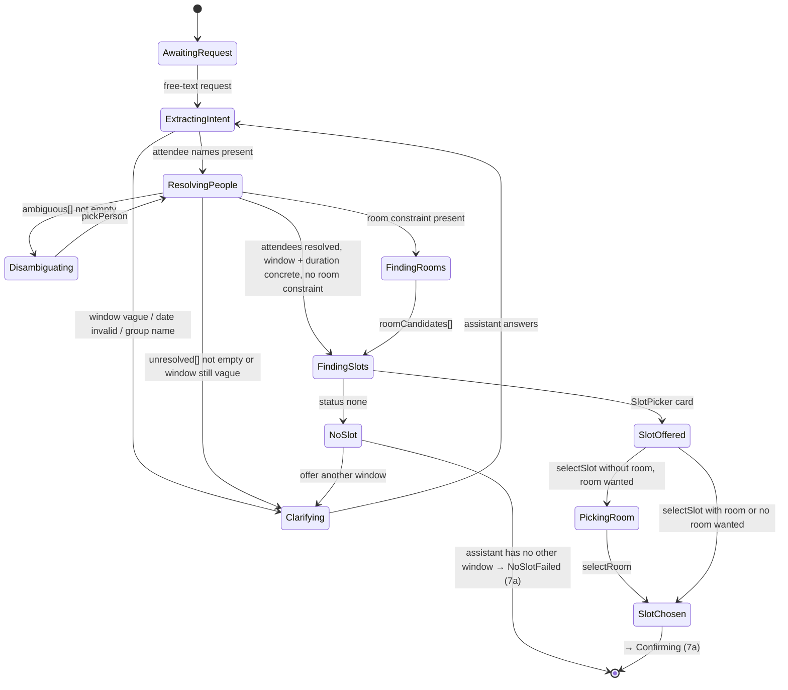
```mermaid
stateDiagram-v2
  [*] --> AwaitingRequest
  AwaitingRequest --> ExtractingIntent: free-text request
  ExtractingIntent --> ResolvingPeople: attendee names present
  ExtractingIntent --> Clarifying: window vague / date invalid / group name
  ResolvingPeople --> Disambiguating: ambiguous[] not empty
  Disambiguating --> ResolvingPeople: pickPerson
  ResolvingPeople --> Clarifying: unresolved[] not empty or window still vague
  Clarifying --> ExtractingIntent: assistant answers
  ResolvingPeople --> FindingRooms: room constraint present
  ResolvingPeople --> FindingSlots: attendees resolved, window + duration concrete, no room constraint
  FindingRooms --> FindingSlots: roomCandidates[]
  FindingSlots --> NoSlot: status none
  NoSlot --> Clarifying: offer another window
  NoSlot --> [*]: assistant has no other window → NoSlotFailed (7a)
  FindingSlots --> SlotOffered: SlotPicker card
  SlotOffered --> PickingRoom: selectSlot without room, room wanted
  PickingRoom --> SlotChosen: selectRoom
  SlotOffered --> SlotChosen: selectSlot with room or no room wanted
  SlotChosen --> [*]: → Confirming (7a)
```

---

## 8. BookingRequest lifecycle

The status machine of the ledger row in `mba_BookingRequest`, including who performs each transition and the asynchronous room-response sub-state that the nightly job closes.

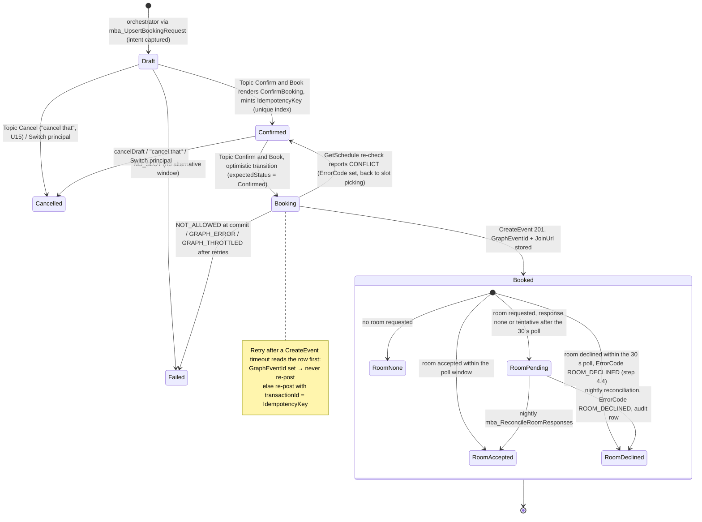
```mermaid
stateDiagram-v2
  [*] --> Draft: orchestrator via mba_UpsertBookingRequest (intent captured)
  Draft --> Confirmed: Topic Confirm and Book renders ConfirmBooking, mints IdempotencyKey (unique index)
  Draft --> Cancelled: Topic Cancel ("cancel that", U15) / Switch principal
  Draft --> Failed: NO_SLOT (no alternative window)
  Confirmed --> Cancelled: cancelDraft / "cancel that" / Switch principal
  Confirmed --> Booking: Topic Confirm and Book, optimistic transition (expectedStatus = Confirmed)
  Booking --> Confirmed: GetSchedule re-check reports CONFLICT (ErrorCode set, back to slot picking)
  Booking --> Booked: CreateEvent 201, GraphEventId + JoinUrl stored
  Booking --> Failed: NOT_ALLOWED at commit / GRAPH_ERROR / GRAPH_THROTTLED after retries
  Booked --> [*]

  state Booked {
    [*] --> RoomNone: no room requested
    [*] --> RoomAccepted: room accepted within the poll window
    [*] --> RoomDeclined: room declined within the 30 s poll, ErrorCode ROOM_DECLINED (step 4.4)
    [*] --> RoomPending: room requested, response none or tentative after the 30 s poll
    RoomPending --> RoomAccepted: nightly mba_ReconcileRoomResponses
    RoomPending --> RoomDeclined: nightly reconciliation, ErrorCode ROOM_DECLINED, audit row
  }

  note right of Booking
    Retry after a CreateEvent timeout reads the row first:
    GraphEventId set → never re-post
    else re-post with transactionId = IdempotencyKey
  end note
```

---

## 9. Data model

Dataverse tables in the `MeetingAgent` solution. All instants are stored as UTC. `RequesterTz` / `OrganizerTz` hold IANA ids (design §4.7, D7); Windows names appear only in `mba_TimeZoneMap`, consulted by `mba_MapTimeZone` and `mba_FormatSlots`.

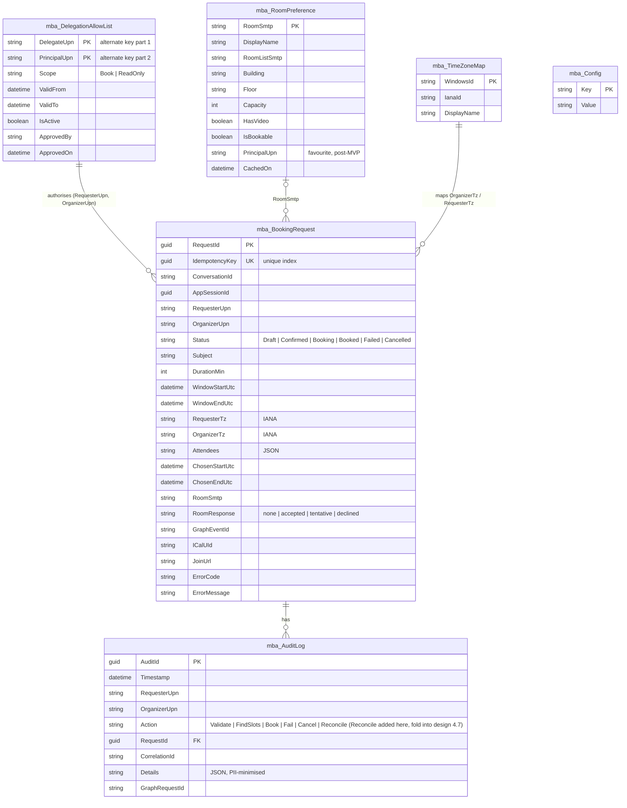
```mermaid
erDiagram
  mba_DelegationAllowList {
    string DelegateUpn PK "alternate key part 1"
    string PrincipalUpn PK "alternate key part 2"
    string Scope "Book | ReadOnly"
    datetime ValidFrom
    datetime ValidTo
    boolean IsActive
    string ApprovedBy
    datetime ApprovedOn
  }
  mba_BookingRequest {
    guid RequestId PK
    guid IdempotencyKey UK "unique index"
    string ConversationId
    guid AppSessionId
    string RequesterUpn
    string OrganizerUpn
    string Status "Draft | Confirmed | Booking | Booked | Failed | Cancelled"
    string Subject
    int DurationMin
    datetime WindowStartUtc
    datetime WindowEndUtc
    string RequesterTz "IANA"
    string OrganizerTz "IANA"
    string Attendees "JSON"
    datetime ChosenStartUtc
    datetime ChosenEndUtc
    string RoomSmtp
    string RoomResponse "none | accepted | tentative | declined"
    string GraphEventId
    string ICalUId
    string JoinUrl
    string ErrorCode
    string ErrorMessage
  }
  mba_AuditLog {
    guid AuditId PK
    datetime Timestamp
    string RequesterUpn
    string OrganizerUpn
    string Action "Validate | FindSlots | Book | Fail | Cancel | Reconcile (Reconcile added here, fold into design 4.7)"
    guid RequestId FK
    string CorrelationId
    string Details "JSON, PII-minimised"
    string GraphRequestId
  }
  mba_RoomPreference {
    string RoomSmtp PK
    string DisplayName
    string RoomListSmtp
    string Building
    string Floor
    int Capacity
    boolean HasVideo
    boolean IsBookable
    string PrincipalUpn "favourite, post-MVP"
    datetime CachedOn
  }
  mba_TimeZoneMap {
    string WindowsId PK
    string IanaId
    string DisplayName
  }
  mba_Config {
    string Key PK
    string Value
  }

  mba_DelegationAllowList ||--o{ mba_BookingRequest : "authorises (RequesterUpn, OrganizerUpn)"
  mba_BookingRequest ||--o{ mba_AuditLog : "has"
  mba_RoomPreference o|--o{ mba_BookingRequest : "RoomSmtp"
  mba_TimeZoneMap ||--o{ mba_BookingRequest : "maps OrganizerTz / RequesterTz"
```

**Security roles.** `MBA User`: read allow-list rows where `DelegateUpn = self`; create/read own booking requests. `MBA Admin` (service account, flows): full access. The canvas app reads `mba_DelegationAllowList` for the picker and — only if S1 check 5 fails and the §5.2 polling fallback is selected at 1.11 — its own `mba_BookingRequest` rows by `AppSessionId`; every other table is touched through flows.

---

## 10. Failure paths

Every failure the design names, where it is detected, and what the assistant sees. Flows and connector actions return `status` + `errorCode`; they never throw into the conversation. **10a** covers gathering, **10b** covers commit.

### 10a — Gathering failures

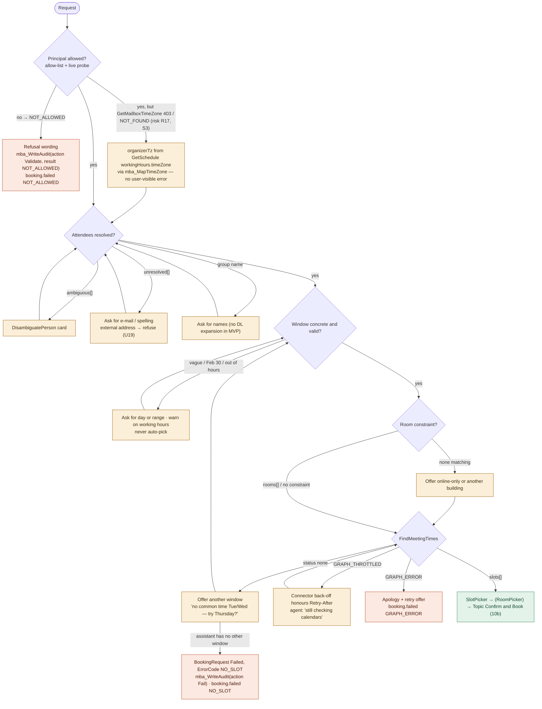
```mermaid
flowchart TD
  classDef ok fill:#e3f3e9,stroke:#2e7d4f,color:#143
  classDef warn fill:#fbefd9,stroke:#9a5b00,color:#3c2c10
  classDef crit fill:#fce9e1,stroke:#b4401a,color:#4a1c0c

  S([Request]) --> V{"Principal allowed?<br/>allow-list + live probe"}
  V -- "no → NOT_ALLOWED" --> R1["Refusal wording<br/>mba_WriteAudit(action Validate, result NOT_ALLOWED)<br/>booking.failed NOT_ALLOWED"]:::crit
  V -- "yes, but GetMailboxTimeZone 403 / NOT_FOUND (risk R17, S3)" --> TZF["organizerTz from GetSchedule workingHours.timeZone<br/>via mba_MapTimeZone — no user-visible error"]:::warn --> P
  V -- yes --> P{"Attendees resolved?"}
  P -- "ambiguous[]" --> C1["DisambiguatePerson card"]:::warn --> P
  P -- "unresolved[]" --> C2["Ask for e-mail / spelling<br/>external address → refuse (U19)"]:::warn --> P
  P -- "group name" --> C3["Ask for names (no DL expansion in MVP)"]:::warn --> P
  P -- yes --> W{"Window concrete and valid?"}
  W -- "vague / Feb 30 / out of hours" --> C4["Ask for day or range · warn on working hours<br/>never auto-pick"]:::warn --> W
  W -- yes --> RM{"Room constraint?"}
  RM -- "none matching" --> C5["Offer online-only or another building"]:::warn --> SL
  RM -- "rooms[] / no constraint" --> SL{"FindMeetingTimes"}
  SL -- "status none" --> C6["Offer another window<br/>'no common time Tue/Wed — try Thursday?'"]:::warn --> W
  C6 -- "assistant has no other window" --> NS["BookingRequest Failed, ErrorCode NO_SLOT<br/>mba_WriteAudit(action Fail) · booking.failed NO_SLOT"]:::crit
  SL -- "GRAPH_THROTTLED" --> T1["Connector back-off honours Retry-After<br/>agent: 'still checking calendars'"]:::warn --> SL
  SL -- "GRAPH_ERROR" --> E1["Apology + retry offer<br/>booking.failed GRAPH_ERROR"]:::crit
  SL -- "slots[]" --> PICK["SlotPicker → (RoomPicker) → Topic Confirm and Book (10b)"]:::ok
```

### 10b — Commit failures

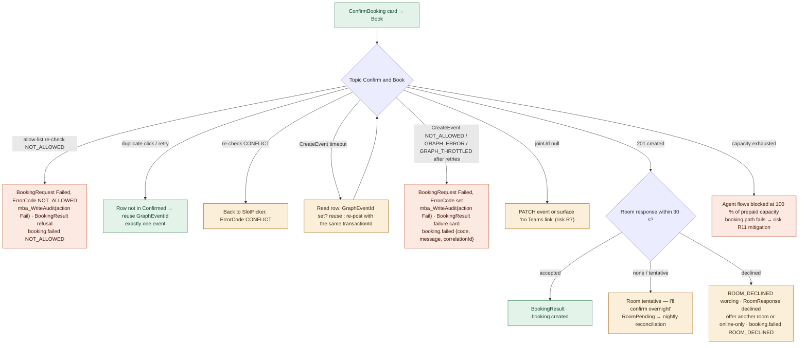
```mermaid
flowchart TD
  classDef ok fill:#e3f3e9,stroke:#2e7d4f,color:#143
  classDef warn fill:#fbefd9,stroke:#9a5b00,color:#3c2c10
  classDef crit fill:#fce9e1,stroke:#b4401a,color:#4a1c0c

  PICK["ConfirmBooking card → Book"]:::ok --> B{"Topic Confirm and Book"}
  B -- "allow-list re-check NOT_ALLOWED" --> F0["BookingRequest Failed, ErrorCode NOT_ALLOWED<br/>mba_WriteAudit(action Fail) · BookingResult refusal<br/>booking.failed NOT_ALLOWED"]:::crit
  B -- "duplicate click / retry" --> I1["Row not in Confirmed → reuse GraphEventId<br/>exactly one event"]:::ok
  B -- "re-check CONFLICT" --> I2["Back to SlotPicker, ErrorCode CONFLICT"]:::warn
  B -- "CreateEvent timeout" --> I3["Read row: GraphEventId set? reuse : re-post with the same transactionId"]:::warn --> B
  B -- "CreateEvent NOT_ALLOWED / GRAPH_ERROR / GRAPH_THROTTLED after retries" --> F1["BookingRequest Failed, ErrorCode set<br/>mba_WriteAudit(action Fail) · BookingResult failure card<br/>booking.failed {code, message, correlationId}"]:::crit
  B -- "joinUrl null" --> I4["PATCH event or surface 'no Teams link' (risk R7)"]:::warn
  B -- "201 created" --> RP{"Room response within 30 s?"}
  RP -- accepted --> OK["BookingResult · booking.created"]:::ok
  RP -- "none / tentative" --> TEN["'Room tentative — I'll confirm overnight'<br/>RoomPending → nightly reconciliation"]:::warn
  RP -- declined --> DEC["ROOM_DECLINED wording · RoomResponse declined<br/>offer another room or online-only · booking.failed ROOM_DECLINED"]:::warn
  B -- "capacity exhausted" --> CAP["Agent flows blocked at 100 % of prepaid capacity<br/>booking path fails → risk R11 mitigation"]:::crit
```

---

## 11. Nightly jobs

The only two flows that call Graph without an assistant in the loop. Both run under the service account's `mba_cr_Graph` connection.

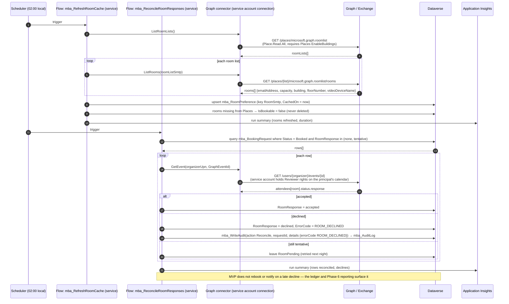
```mermaid
sequenceDiagram
  autonumber
  participant SCH as Scheduler (02:00 local)
  participant RC as Flow: mba_RefreshRoomCache (service)
  participant RR as Flow: mba_ReconcileRoomResponses (service)
  participant CONN as Graph connector (service account connection)
  participant G as Graph / Exchange
  participant DV as Dataverse
  participant AI as Application Insights

  SCH->>RC: trigger
  RC->>CONN: ListRoomLists()
  CONN->>G: GET /places/microsoft.graph.roomlist<br/>(Place.Read.All, requires Places EnableBuildings)
  G-->>CONN: roomLists[]
  loop each room list
    RC->>CONN: ListRooms(roomListSmtp)
    CONN->>G: GET /places/{list}/microsoft.graph.roomlist/rooms
    G-->>CONN: rooms[] {emailAddress, capacity, building, floorNumber, videoDeviceName}
  end
  RC->>DV: upsert mba_RoomPreference (key RoomSmtp, CachedOn = now)
  RC->>DV: rooms missing from Places → IsBookable = false (never deleted)
  RC->>AI: run summary (rooms refreshed, duration)

  SCH->>RR: trigger
  RR->>DV: query mba_BookingRequest where Status = Booked and RoomResponse in (none, tentative)
  DV-->>RR: rows[]
  loop each row
    RR->>CONN: GetEvent(organizerUpn, GraphEventId)
    CONN->>G: GET /users/{organizer}/events/{id}<br/>(service account holds Reviewer rights on the principal's calendar)
    G-->>CONN: attendees[room].status.response
    alt accepted
      RR->>DV: RoomResponse = accepted
    else declined
      RR->>DV: RoomResponse = declined, ErrorCode = ROOM_DECLINED
      RR->>DV: mba_WriteAudit(action Reconcile, requestId, details {errorCode ROOM_DECLINED}) → mba_AuditLog
    else still tentative
      RR->>DV: leave RoomPending (retried next night)
    end
  end
  RR->>AI: run summary (rows reconciled, declines)
  Note over RR,DV: MVP does not rebook or notify on a late decline — the ledger and Phase 6 reporting surface it
```

---

## 12. Provisioning and identity setup

The admin-side dependency graph for week 1. Amber = provisioning performed by the admin (requester in brackets); the critical path is 0.0 / 0.7 → 1.1 → 1.3 → 1.7.

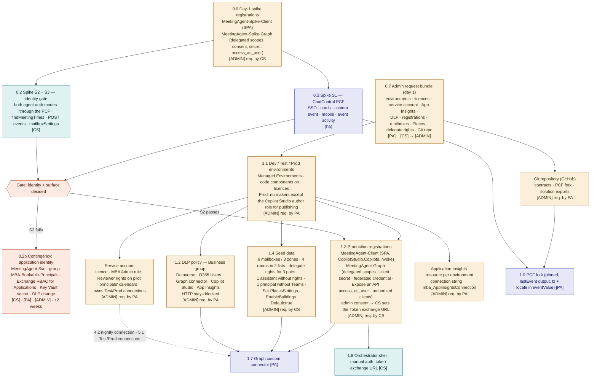
```mermaid
flowchart TD
  classDef admin fill:#fbefd9,stroke:#9a5b00,color:#3c2c10
  classDef pa fill:#e6e8f8,stroke:#3f4fb5,color:#1b2160
  classDef cs fill:#e0f1f2,stroke:#0b6e78,color:#06272a
  classDef gate fill:#fce9e1,stroke:#b4401a,color:#4a1c0c

  S00["0.0 Day-1 spike registrations<br/>MeetingAgent-Spike-Client (SPA)<br/>MeetingAgent-Spike-Graph (delegated scopes, consent, secret, access_as_user)<br/>[ADMIN] req. by CS"]:::admin
  S07["0.7 Admin request bundle (day 1)<br/>environments · licences · service account · App Insights ·<br/>DLP · registrations · mailboxes · Places · delegate rights · Git repo<br/>[PA] + [CS] → [ADMIN]"]:::admin

  S03["0.3 Spike S1 — ChatControl PCF<br/>SSO · cards · custom event · mobile · event activity<br/>[PA]"]:::pa
  S02["0.2 Spike S2 + S3 — identity gate<br/>both agent auth modes through the PCF ·<br/>findMeetingTimes · POST events · mailboxSettings<br/>[CS]"]:::cs
  G1{{"Gate: identity + surface decided"}}:::gate
  S02b["0.2b Contingency: application identity<br/>MeetingAgent-Svc · group MBA-Bookable-Principals ·<br/>Exchange RBAC for Applications · Key Vault secret · DLP change<br/>[CS] · [PA] · [ADMIN] · +2 weeks"]:::gate

  E11["1.1 Dev / Test / Prod environments<br/>Managed Environments · code components on · licences<br/>Prod: no makers except the Copilot Studio author role for publishing<br/>[ADMIN] req. by PA"]:::admin
  E12["1.2 DLP policy — Business group:<br/>Dataverse · O365 Users · Graph connector · Copilot Studio · App Insights<br/>HTTP stays blocked<br/>[ADMIN] req. by PA"]:::admin
  E13["1.3 Production registrations<br/>MeetingAgent-Client (SPA, CopilotStudio.Copilots.Invoke)<br/>MeetingAgent-Graph (delegated scopes · client secret · federated credential ·<br/>Expose an API access_as_user · authorized clients)<br/>admin consent → CS sets the Token exchange URL<br/>[ADMIN] req. by CS"]:::admin
  E14["1.4 Seed data<br/>6 mailboxes / 3 zones · 4 rooms in 2 lists · delegate rights for 3 pairs ·<br/>1 assistant without rights · 1 principal without Teams ·<br/>Set-PlacesSettings -EnableBuildings Default:true<br/>[ADMIN] req. by CS"]:::admin
  SVC["Service account<br/>licence · MBA Admin role · Reviewer rights on pilot principals' calendars ·<br/>owns Test/Prod connections<br/>[ADMIN] req. by PA"]:::admin
  AIRES["Application Insights resource per environment<br/>connection string → mba_AppInsightsConnection<br/>[ADMIN] req. by PA"]:::admin
  REPO["Git repository (GitHub)<br/>contracts · PCF fork · solution exports<br/>[ADMIN] req. by PA"]:::admin

  S00 --> S03 & S02
  S07 --> E11 --> E12
  E11 --> E13 & E14 & SVC & AIRES
  S07 --> REPO
  S03 --> G1
  S02 --> G1
  G1 -- "S2 fails" --> S02b
  G1 -- "S2 passes" --> E13
  E13 --> C17["1.7 Graph custom connector [PA]"]:::pa
  E13 --> C18["1.8 Orchestrator shell, manual auth, token exchange URL [CS]"]:::cs
  E14 --> C17
  E12 --> C17
  SVC -. "4.2 nightly connection · 5.1 Test/Prod connections" .-> C17
  REPO --> C19["1.9 PCF fork (pinned, lastEvent output, tz + locale in eventValue) [PA]"]:::pa
  S03 --> C19
```

---

## 13. ALM and deployment

One solution, three environments, and the manual actions the pipeline cannot do for you. Deploy Dev → Test is pipeline step 1.10; manual export/import is acceptable for the first Test deployment if the pipeline slips.

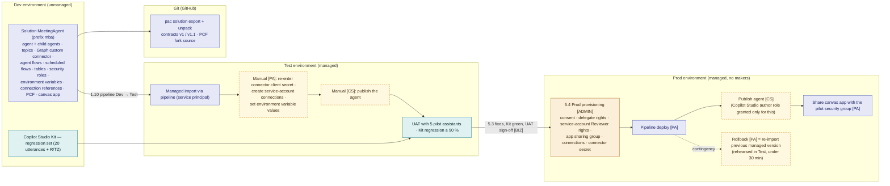
```mermaid
flowchart LR
  classDef env fill:#eef2f6,stroke:#8a97a6,color:#222
  classDef pa fill:#e6e8f8,stroke:#3f4fb5,color:#1b2160
  classDef cs fill:#e0f1f2,stroke:#0b6e78,color:#06272a
  classDef manual fill:#fff8e1,stroke:#c77700,stroke-dasharray:4 3,color:#3c2c10
  classDef admin fill:#fbefd9,stroke:#9a5b00,color:#3c2c10

  subgraph DEV["Dev environment (unmanaged)"]
    SOL["Solution MeetingAgent (prefix mba)<br/>agent + child agents · topics · Graph custom connector ·<br/>agent flows · scheduled flows · tables · security roles ·<br/>environment variables · connection references · PCF · canvas app"]:::pa
    KIT["Copilot Studio Kit — regression set (20 utterances + R/TZ)"]:::cs
  end
  subgraph SRC["Git (GitHub)"]
    UNPACK["pac solution export + unpack<br/>contracts v1 / v1.1 · PCF fork source"]:::pa
  end
  subgraph TEST["Test environment (managed)"]
    T_IMP["Managed import via pipeline (service principal)"]:::pa
    T_SEC["Manual [PA]: re-enter connector client secret ·<br/>create service-account connections ·<br/>set environment variable values"]:::manual
    T_PUB["Manual [CS]: publish the agent"]:::manual
    UAT["UAT with 5 pilot assistants · Kit regression ≥ 90 %"]:::cs
  end
  subgraph PROD["Prod environment (managed, no makers)"]
    P_PROV["5.4 Prod provisioning [ADMIN]<br/>consent · delegate rights · service-account Reviewer rights ·<br/>app sharing group · connections · connector secret"]:::admin
    P_IMP["Pipeline deploy [PA]"]:::pa
    P_PUB["Publish agent [CS]<br/>(Copilot Studio author role granted only for this)"]:::manual
    P_SHARE["Share canvas app with the pilot security group [PA]"]:::pa
    ROLL["Rollback [PA] = re-import previous managed version<br/>(rehearsed in Test, under 30 min)"]:::manual
  end

  SOL --> UNPACK
  SOL -- "1.10 pipeline Dev → Test" --> T_IMP
  T_IMP --> T_SEC --> T_PUB --> UAT
  KIT --> UAT
  UAT -- "5.3 fixes, Kit green, UAT sign-off [BIZ]" --> P_PROV
  P_PROV --> P_IMP --> P_PUB --> P_SHARE
  P_IMP -. contingency .-> ROLL
```

---

## 14. Observability and correlation

One booking must be traceable app → agent → connector → Dataverse with a single query. This is how the identifiers travel; dotted edges are identifier hand-offs, not call paths.

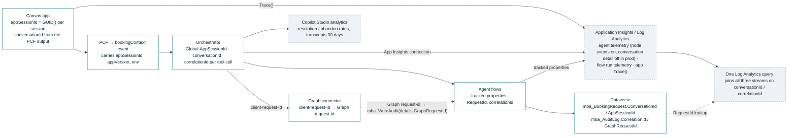
```mermaid
flowchart LR
  classDef id fill:#fff,stroke:#0b6e78,color:#06272a
  classDef sink fill:#eef2f6,stroke:#8a97a6,stroke-dasharray:4 3,color:#222

  APP["Canvas app<br/>appSessionId = GUID() per session<br/>conversationId from the PCF output"]:::id
  PCF["PCF → bookingContext event<br/>carries appSessionId, appVersion, env"]:::id
  AGENT["Orchestrator<br/>Global.AppSessionId · conversationId ·<br/>correlationId per tool call"]:::id
  FLOW["Agent flows<br/>tracked properties: RequestId, correlationId"]:::id
  CONN["Graph connector<br/>client-request-id → Graph request-id"]:::id
  DV["Dataverse<br/>mba_BookingRequest.ConversationId / AppSessionId<br/>mba_AuditLog.CorrelationId / GraphRequestId"]:::id
  AI["Application Insights / Log Analytics<br/>agent telemetry (node events on, conversation detail off in prod) ·<br/>flow run telemetry · app Trace()"]:::sink
  CSA["Copilot Studio analytics<br/>resolution / abandon rates, transcripts 30 days"]:::sink
  JOIN["One Log Analytics query joins all three streams on conversationId / correlationId"]:::sink

  APP --> PCF --> AGENT --> FLOW --> DV
  AGENT -- "client-request-id" --> CONN
  CONN -. "Graph request-id → mba_WriteAudit(details.GraphRequestId)" .-> FLOW
  APP -- "Trace()" --> AI
  AGENT -- "App Insights connection" --> AI
  FLOW -- "tracked properties" --> AI
  AGENT --> CSA
  AI --> JOIN
  DV -. "RequestId lookup" .-> JOIN
```

**Hypercare signals (step 5.6).** Failed-conversation rate < 5 % in week 10, flow run failures, `ROOM_DECLINED` and `NOT_ALLOWED` counts from the audit table, Copilot Credit consumption on the agent-flow line (risk R11).

---

## 15. Delivery timeline

Relative weeks: week 1 = 7 Sep 2026 (placeholder so the chart renders), week 10 = 9 Nov 2026. Full step tables, owners and acceptance criteria are in design §6.

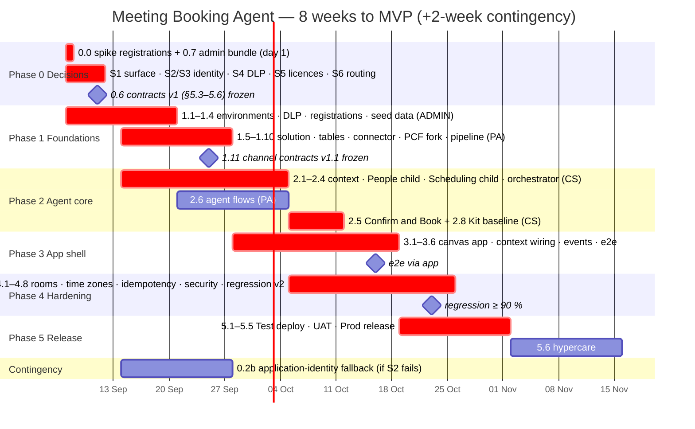
```mermaid
gantt
  title Meeting Booking Agent — 8 weeks to MVP (+2-week contingency)
  dateFormat YYYY-MM-DD
  axisFormat %d %b
  section Phase 0 Decisions
  0.0 spike registrations + 0.7 admin bundle (day 1)   :crit, p00, 2026-09-07, 1d
  S1 surface · S2/S3 identity · S4 DLP · S5 licences · S6 routing :crit, p0, 2026-09-07, 5d
  0.6 contracts v1 (§5.3–5.6) frozen                    :milestone, m1, 2026-09-11, 0d
  section Phase 1 Foundations
  1.1–1.4 environments · DLP · registrations · seed data (ADMIN) :crit, p1a, 2026-09-07, 14d
  1.5–1.10 solution · tables · connector · PCF fork · pipeline (PA) :crit, p1b, 2026-09-14, 14d
  1.11 channel contracts v1.1 frozen                    :milestone, m2, 2026-09-25, 0d
  section Phase 2 Agent core
  2.1–2.4 context · People child · Scheduling child · orchestrator (CS) :crit, p2a, 2026-09-14, 21d
  2.6 agent flows (PA)                                  :p2b, 2026-09-21, 14d
  2.5 Confirm and Book + 2.8 Kit baseline (CS)          :crit, p2c, 2026-10-05, 7d
  section Phase 3 App shell
  3.1–3.6 canvas app · context wiring · events · e2e    :crit, p3, 2026-09-28, 21d
  e2e via app                                           :milestone, m3, 2026-10-16, 0d
  section Phase 4 Hardening
  4.1–4.8 rooms · time zones · idempotency · security · regression v2 :crit, p4, 2026-10-05, 21d
  regression ≥ 90 %                                     :milestone, m4, 2026-10-23, 0d
  section Phase 5 Release
  5.1–5.5 Test deploy · UAT · Prod release              :crit, p5, 2026-10-19, 14d
  5.6 hypercare                                         :p6, 2026-11-02, 14d
  section Contingency
  0.2b application-identity fallback (if S2 fails)      :p7, 2026-09-14, 14d
```

---

## 16. Resource inventory

Every resource the system needs, who creates it, where it lives, and which identity uses it. IDs are `RS` to keep them distinct from design risks `R1`–`R17`.

| # | Resource | Type | Environment | Created by | Used by / as |
|---|---|---|---|---|---|
| RS1 | `MeetingAgent-Client` | Entra app registration (SPA) | Tenant | `[ADMIN]` req. CS (1.3) | PCF, MSAL silent token, `CopilotStudio.Copilots.Invoke` |
| RS2 | `MeetingAgent-Graph` | Entra app registration (web) | Tenant | `[ADMIN]` req. CS (1.3) | Agent manual auth (federated credential); custom connector OAuth (client secret); `access_as_user` exposed |
| RS3 | `MeetingAgent-Spike-*` | Throwaway registrations | Dev tenant | `[ADMIN]` req. CS (0.0) | Spikes S1–S3 only; deleted after week 1 |
| RS4 | Dev / Test / Prod | Power Platform environments with Dataverse (Managed) | — | `[ADMIN]` req. PA (1.1) | Everything |
| RS5 | DLP policy | Power Platform policy | All three | `[ADMIN]` req. PA (1.2) | Permits Dataverse, O365 Users, Graph connector, Copilot Studio, App Insights; blocks HTTP |
| RS6 | Service account | Licensed user, `MBA Admin`, Reviewer on pilot calendars | Test, Prod | `[ADMIN]` req. PA (0.7) | Owns `mba_cr_*` connections; runs flows and nightly jobs |
| RS7 | Application Insights | Azure resource | One per environment | `[ADMIN]` req. PA (0.7) | Agent, flows, app telemetry |
| RS8 | Git repository | GitHub | — | `[ADMIN]` req. PA (0.7) | Contracts, PCF fork, solution exports |
| RS9 | Solution `MeetingAgent` | Dataverse solution, prefix `mba` | Dev → Test → Prod | `[PA]` (1.5) | Container for RS10–RS17 |
| RS10 | `mba_*` tables + security roles | Dataverse | In solution | `[PA]` (1.6) | Flows (service), canvas app (assistant, allow-list only) |
| RS11 | Graph custom connector | Custom connector, OAuth 2.0 Entra | In solution; secret per environment | `[PA]` (1.7) | Agent tools as the assistant; nightly flows as the service account |
| RS12 | Agent flows (7) | Power Automate, trigger "When an agent calls the flow" | In solution | `[PA]` (2.6) | Orchestrator and children, service connection |
| RS13 | Scheduled flows (2) | Power Automate, recurrence | In solution | `[PA]` (2.6 / 4.2) | Nightly, service connection |
| RS14 | Booking Orchestrator + 3 child agents + topics + cards | Copilot Studio, standard harness | In solution | `[CS]` (1.8, 2.1–2.5, 4.1) | Assistants via the PCF |
| RS15 | ChatControl PCF (fork) | Code component | In solution | `[PA]` (1.9) | Canvas app |
| RS16 | Canvas app | Power Apps | In solution | `[PA]` (3.1) | Assistants (premium licence) |
| RS17 | Environment variables `mba_EnvName` · `mba_AppVersion` · `mba_TenantId` · `mba_EnvironmentId` · `mba_AgentSchemaName` · `mba_PcfClientId` · `mba_GraphClientId` · `mba_DefaultTz` · `mba_AppInsightsConnection`; connection references `mba_cr_Dataverse` · `mba_cr_O365Users` · `mba_cr_Graph` | Solution components | Per-environment values | `[PA]` (1.5) | PCF (client id, tenant, environment, agent schema name); canvas app (`AppVersion`, `EnvName` → `bookingContext`); agent (App Insights connection); flows and nightly jobs (`mba_cr_*`); pipeline binds per environment |
| RS18 | Copilot Studio Kit + regression set | Test tooling | Dev, Test | `[CS]` (2.8) | Regression gate (4.8) |
| RS19 | Power Platform pipeline | ALM | Dev → Test → Prod | `[PA]` (1.10) | Deployments; agent publish is manual `[CS]` |
| RS20 | Delegate rights assistant → principal | Exchange calendar permission | Tenant | Principal or `[ADMIN]` (1.4, 5.4) | The authority for every booking write |
| RS21 | Places settings `EnableBuildings` | Exchange / Places | Tenant | `[ADMIN]` req. CS (1.4) | Required for room lists to return anything |
| RS22 | Copilot Credit allocation + pay-as-you-go | Capacity | MeetingAgent environments | `[ADMIN]` req. PA (0.7), sized by CS in S5 (0.4) | Agent + agent flows; flows block at 100 % prepaid |
| RS23 | Key Vault secret env var `mba_GraphClientSecret` | Secret | Fallback branch only | `[ADMIN]`/`[PA]` (0.2b) | Client-credential flows if S2 fails |
| RS24 | Seed test mailboxes and rooms — 6 mailboxes / 3 zones, 4 room mailboxes in 2 room lists, delegate rights for 3 pairs, 1 assistant without rights, 1 principal without Teams | Exchange mailboxes + room lists | Test tenant (or isolated Test environment) | `[ADMIN]` req. CS (1.4) | S3, connector test collection (1.7), Kit regression, UAT |
| RS25 | Power Apps premium licences (per-user or per-app) for the pilot assistants | Licence | Tenant | `[ADMIN]` req. PA (0.7, 1.1); counts from S5 (0.4) | Canvas app users — premium because of the PCF external call + Dataverse |
| RS26 | Pilot app-sharing security group | Entra security group | Tenant | `[ADMIN]` req. PA (5.4) | Canvas app sharing (5.5) |
| RS27 | Pipeline deployment service principal | Entra app registration + Power Platform roles | Tenant; Test/Prod | `[ADMIN]` req. PA (1.10) | Power Platform pipeline (RS19); least roles per design §9 |
| RS28 | Copilot Studio author role in Prod for CS (or the deployment service account) | Environment security role | Prod | `[ADMIN]` req. PA (1.1) | Publishing the agent after each import (5.5) |
| RS29 | Fallback only: `MeetingAgent-Svc` · mail-enabled security group `MBA-Bookable-Principals` · Exchange management scope "Bookable principals" + role assignment `Application Calendars.ReadWrite` · DLP change for the client-credential connector | Entra + Exchange + DLP | Tenant | `[ADMIN]` req. CS (0.2b) | Application-identity flows if S2 fails |

---

## 17. Touchpoint inventory

The numbered edges of [§2](#2-runtime-components-and-touchpoints), with protocol, identity, contract reference and the spike or step that proves each one.

| T | From → To | Mechanism | Identity | Contract / spec | Proven by |
|---|---|---|---|---|---|
| T1 | Canvas app → Dataverse | Dataverse connector, filtered read of `mba_DelegationAllowList`; polling fallback (§5.2, only if S1 check 5 fails): read of own `mba_BookingRequest` rows by `AppSessionId` | (app) assistant | §4.7, role `MBA User` | 3.4 |
| T2 | Picker → PCF | Power Fx sets `eventValue` (JSON) | (none) | §5.1 | 3.2 |
| T3 | PCF → Entra | MSAL silent token for `MeetingAgent-Client` | (app) assistant | §4.2 | S1 (0.3) |
| T4 | PCF → Orchestrator | M365 Agents SDK conversation + custom event `bookingContext` | (app) assistant | §5.1, topic Context | S1, 1.9 |
| T5 | Orchestrator → Entra | Manual auth SSO token exchange (`access_as_user`, Token exchange URL) | (assistant) | §4.4 | S2 (0.2) |
| T6 | Orchestrator → children | Typed inputs/outputs of child agents | (none) | §4.3 | 2.2–2.3, 4.1, S6 |
| T7 | Children → Graph connector | Connector tools with user authentication | (assistant) | §5.3 | S2, 1.7 |
| T8 | Confirm and Book → Graph connector | `GetSchedule` re-check, `CreateEvent`, `GetEvent` as action nodes (never Tools) | (assistant) | §5.3, §9 checklist | 2.5 |
| T9 | Orchestrator, children, Confirm and Book → flows | "When an agent calls the flow", JSON in/out, `status` + `errorCode` | (service) | §5.4 | 2.6 |
| T10 | Graph connector → Entra | OAuth 2.0 auth-code, one-time consent per assistant (or on-behalf-of login) | (assistant) | §4.4 | S2, 1.7 |
| T11 | Graph connector → Graph | REST: `/users?$search`, `findMeetingTimes`, `getSchedule`, `/places`, `POST /users/{p}/events`, `GET …/events/{id}` | (assistant) | §4.5 | S3 |
| T12 | Graph → Exchange | Delegate-rights enforcement, room mailbox responses | (assistant) | §4.4 | S3 |
| T13 | Flows and nightly flows → Dataverse | Dataverse connector CRUD, alternate keys, optimistic status transitions | (service) | §4.7, §5.5 | 2.6, 4.4 |
| T14 | Nightly flows → Graph connector | `ListRoomLists`/`ListRooms`, `GetEvent` under `mba_cr_Graph` | (service) | §5.4 | 4.2, 4.4 |
| T15 | Orchestrator → PCF | Event activities `booking.created`, `booking.failed`, `agent.ready`, `principal.reset` | (none) | §5.2 | S1 check 5, 1.9, 3.3 |
| T16 | PCF → app | `lastEvent {name, value}` and `conversationId` outputs | (none) | §5.2 | 1.9, 3.2 |
| T17 | App / agent / flows → App Insights | `Trace()`, agent App Insights connection, flow tracked properties | (none) | §4.8 | 4.7 |

---

*Meeting Booking Agent — end-to-end flows v1.1 · 2026-08-23 · companion to the design document v1.1. Prepared by the Copilot developer for the Power App developer, the M365 admin and the business owner.*
